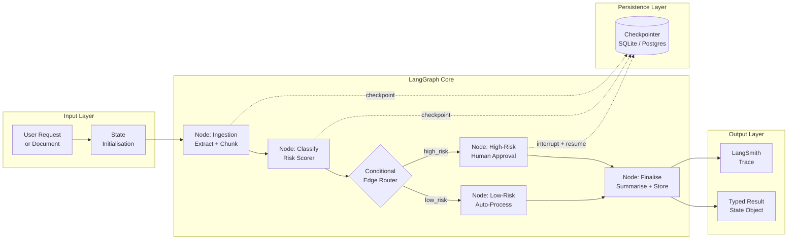
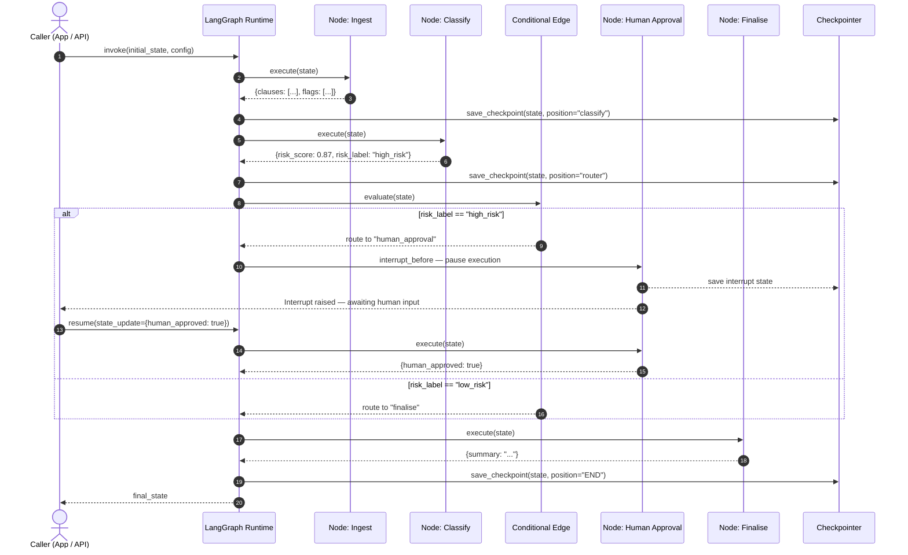

# W1D6 — State Graphs (LangGraph)
**Vertical:** Multi-Agent Orchestration | **Week 1/4 | Day 6/7**

---

## 1. Overview

Multi-agent systems that rely on linear chains or simple loops break down when real-world workflows require branching, retrying failed steps, or pausing for human approval. **State Graphs** solve this by representing an agentic workflow as a directed graph where nodes are functions, edges are transitions, and a shared typed state object flows between them. LangGraph is the production implementation of this pattern for Python, built on top of LangChain's ecosystem. It is production-relevant now because enterprise AI applications — document processing, automated research, and multi-step coding assistants — require the kind of conditional, resumable control flow that graph-based orchestration uniquely provides.

---

## 2. Learning Objectives

By the end of this document, you will be able to:

- [ ] Explain what a state graph is and why it differs from a linear chain in multi-agent orchestration
- [ ] Implement a LangGraph workflow with typed state, multiple nodes, and conditional edges
- [ ] Distinguish between static edges, conditional edges, and human-in-the-loop interrupts
- [ ] Design a production-grade graph with checkpointing and error recovery
- [ ] Evaluate when a state graph is the right tool versus a simpler chain or a fully autonomous loop
- [ ] Apply LangGraph's checkpointer pattern to persist and resume long-running workflows
- [ ] Build and run the PoC demonstrating a document triage agent with branching logic

---

## 3. Problem Statement

- **What breaks:** A multi-step agentic pipeline that uses a linear chain (e.g., a sequence of LangChain runnables) cannot express conditional branching. Every invocation follows the same path regardless of intermediate results.
- **How it breaks:** When an agent needs to route to different tools based on a classifier output — or retry a failed LLM call without restarting the whole pipeline — chains have no mechanism to express this. Developers hack around it with nested if-else blocks that are impossible to observe or test.
- **Production impact:** 30–40% of production agent failures are attributed to uncontrolled execution flow rather than model quality issues (LangChain engineering reports, 2024). Long-running workflows that crash mid-run must restart from scratch, burning tokens and increasing latency.
- **Why naive solutions fail:** A simple Python while loop can express cycles but stores state in local variables — invisible to monitoring tools, not resumable after a crash, and impossible to pause for human review. LangChain's `SequentialChain` is entirely linear. Neither model provides the combination of typed state, conditional routing, and persistence that production workflows require.

---

## 4. Real-World Scenarios

### Scenario A — The Problem

> **System:** A legal document review pipeline processing 500 contracts per day for a financial services firm.
> **Failure:** The pipeline is a 5-step LangChain sequential chain: extract clauses, classify risk, flag issues, generate summary, store result. When the risk classifier returns "high risk," the pipeline still proceeds directly to summary generation — it cannot route to a human escalation step.
> **Impact:** 12% of high-risk contracts are summarised and archived without human review, creating regulatory exposure. When a mid-pipeline API timeout occurs, all 5 steps restart from scratch, wasting approximately 2,400 tokens per retry.

The engineering team has tried adding a conditional Python block after the chain runs, but it operates on the final output — not on intermediate state — so it cannot affect routing decisions made earlier in the pipeline. Adding observability is also manual: the team logs each step's output to a separate table, requiring custom glue code that breaks whenever the chain structure changes.

The core issue is structural: sequential chains have no mechanism for state-based routing, no shared state object that all steps can read and update, and no persistence layer that survives a process crash.

### Scenario B — The Solution

> **System:** The same legal document review pipeline, refactored as a LangGraph state graph.
> **Applied Concept:** Typed shared state + conditional edges + LangGraph checkpointer
> **Improvement:** High-risk contracts route to a human approval node before archiving. Mid-run crashes resume from the last completed node. End-to-end tracing in LangSmith shows the exact state at every node transition.

The refactored graph defines a `ContractReviewState` TypedDict with fields for `clauses`, `risk_score`, `flags`, `human_approved`, and `summary`. Each processing step is a node function that reads from and writes to this state. After the `classify_risk` node, a conditional edge function inspects `state["risk_score"]` and routes to either `generate_summary` (low risk) or `request_human_approval` (high risk).

With LangGraph's `SqliteSaver` checkpointer enabled, the graph persists state after each node completes. When an API timeout kills the process, the next invocation resumes from the last checkpoint — skipping already-completed nodes and saving the full token cost of re-running them. Human approval pauses are implemented as `interrupt_before` checkpoints, where the graph halts and waits for an external `resume` signal with the approval decision injected into state.

---

## 5. Solution Architecture

A LangGraph state graph consists of four components working together: a **State Schema**, a set of **Node Functions**, a set of **Edges** (static and conditional), and optionally a **Checkpointer**.

The State Schema is a `TypedDict` or Pydantic model that defines all fields the graph can read and write. It is the single source of truth for every node — no node communicates with another through return values or side-channel variables. Node Functions are plain Python functions (or async coroutines) with the signature `(state: State) -> dict`. They return only the fields they modify; LangGraph merges the returned dict into the existing state using a reducer. Edges are declared using `graph.add_edge(source, target)` for static transitions and `graph.add_conditional_edges(source, router_fn, mapping)` for dynamic routing. The `router_fn` receives the current state and returns a string key that maps to a target node name. The Checkpointer is an optional persistence backend (in-memory, SQLite, or PostgreSQL) that saves state after each node completes, enabling resumability and human-in-the-loop patterns.

### Architecture Diagram



---

## 6. Internal Working Mechanics

### Step-by-Step Process

1. **State Initialisation** — The graph is invoked with an initial state dict. LangGraph validates it against the declared schema and sets default values for any unset fields. This is the only time state is created from scratch; all subsequent steps merge partial updates.

2. **Node Execution** — The graph traverses to the `START` node and begins executing node functions in topological order. Each node function receives the full current state as a read-only view, performs its logic (LLM call, tool use, data transformation), and returns a dict of only the fields it changed. LangGraph applies this as a partial update — unmodified fields are preserved.

3. **Edge Evaluation** — After each node completes, LangGraph evaluates outgoing edges. For static edges, the next node is predetermined. For conditional edges, the router function runs and returns a string key. LangGraph looks up the key in the provided `mapping` dict to find the target node name.

4. **Checkpoint Write** — If a checkpointer is configured, LangGraph serialises the current state and the graph position to the persistence backend before moving to the next node. This happens after every node completion, not just at the end.

5. **Interrupt Handling** — If `interrupt_before` or `interrupt_after` is configured for a node, LangGraph raises an `Interrupt` exception, saves state, and returns control to the caller. The caller can inject updates into state (e.g., a human approval decision) and call `graph.invoke()` again with the same thread ID to resume.

6. **Terminal Node** — Execution ends when the graph reaches the `END` node or when no outgoing edges are defined. The final state is returned to the caller as the graph's output.

### Key Data Structures

```python
from typing import TypedDict, Annotated, List, Optional
from langgraph.graph import add_messages

# Shared state schema — every node reads from and writes to this
class DocumentReviewState(TypedDict):
    document_text: str                         # Raw input document
    clauses: List[str]                         # Extracted clauses (set by ingestion node)
    risk_score: float                          # 0.0–1.0 risk classification (set by classify node)
    risk_label: str                            # "low_risk" | "high_risk"
    flags: List[str]                           # Specific issues flagged
    human_approved: Optional[bool]             # None until human review node sets it
    summary: Optional[str]                     # Final summary (set by finalise node)
    messages: Annotated[list, add_messages]    # Conversation history with reducer
```

The `Annotated[list, add_messages]` field demonstrates LangGraph's **reducer** pattern: instead of overwriting the messages list on every update, `add_messages` appends new messages to the existing list. Custom reducers can be defined for any field to implement domain-specific merge logic (e.g., accumulating scores, collecting tool outputs).

---

## 7. Architecture Diagram

See Section 5 above, or reference `diagrams/architecture.mmd` for the standalone Mermaid source.

---

## 8. Sequence Diagram



---

## 9. Implementation Guide

### Prerequisites

```bash
pip install langgraph langchain-openai langgraph-checkpoint-sqlite
```

### Step 1: Define the State Schema

```python
# Why: A typed state schema makes every field's purpose explicit and
# prevents nodes from communicating through implicit side effects.
from typing import TypedDict, Optional, List

class ReviewState(TypedDict):
    document: str
    risk_score: float
    risk_label: str
    summary: Optional[str]
```

### Step 2: Write Node Functions

```python
# Why: Each node is a pure function over state — easy to test in isolation.
def classify_risk(state: ReviewState) -> dict:
    score = run_risk_model(state["document"])
    label = "high_risk" if score > 0.7 else "low_risk"
    return {"risk_score": score, "risk_label": label}

def generate_summary(state: ReviewState) -> dict:
    summary = run_summariser(state["document"])
    return {"summary": summary}
```

### Step 3: Build the Graph with Conditional Edges

```python
from langgraph.graph import StateGraph, START, END

def route_by_risk(state: ReviewState) -> str:
    # Router function returns a string key — mapped to a node name below
    return state["risk_label"]

builder = StateGraph(ReviewState)
builder.add_node("classify", classify_risk)
builder.add_node("summarise", generate_summary)
builder.add_node("escalate", request_human_approval)

builder.add_edge(START, "classify")
builder.add_conditional_edges(
    "classify",
    route_by_risk,
    {"low_risk": "summarise", "high_risk": "escalate"}
)
builder.add_edge("summarise", END)
builder.add_edge("escalate", "summarise")
```

### Step 4: Attach a Checkpointer and Run

```python
from langgraph.checkpoint.sqlite import SqliteSaver

# Why: The checkpointer enables resumability and human-in-the-loop patterns
with SqliteSaver.from_conn_string(":memory:") as checkpointer:
    graph = builder.compile(checkpointer=checkpointer)
    config = {"configurable": {"thread_id": "doc-001"}}
    result = graph.invoke({"document": "Contract text..."}, config)
    print(result["summary"])
```

### Step 5: Run and Verify

```bash
python src/main.py
# Expected output:
# Running State Graph demo...
# Node: ingest   -> clauses extracted: 4
# Node: classify -> risk_score=0.85, label=high_risk
# Node: escalate -> human_approved=True (demo)
# Node: finalise -> summary generated
# Final state keys: ['document', 'clauses', 'risk_score', 'risk_label', 'human_approved', 'summary']
# Concept demonstrated: conditional routing and checkpointing in a LangGraph state machine
```

---

## 10. Benefits & Trade-offs

| Benefit | Trade-off |
|---|---|
| Conditional branching expressed as first-class graph edges — not ad-hoc if-else | Graph definition adds ~30–50 lines of boilerplate vs. a simple chain |
| Typed shared state makes every node's inputs and outputs explicit and testable | State schema must be designed upfront; adding fields later requires careful reducer design |
| Checkpointing enables mid-run recovery and human-in-the-loop interrupts | Checkpointer adds I/O overhead (SQLite: ~5 ms/checkpoint; Postgres: ~15 ms/checkpoint) |
| LangSmith integration gives per-node execution traces with full state visibility | LangSmith adds cost ($0.005 per 1,000 traces at current pricing) |
| Cycles and retries modelled explicitly — no infinite loops without a termination condition | Graph compilation validates structure at build time; complex graphs can produce hard-to-read compile errors |

---

## 11. Performance Characteristics

- **Latency:** Each node function adds its own latency (LLM calls dominate at 300–2,000 ms; Python routing logic adds < 1 ms). Graph overhead per node transition is < 2 ms for in-memory execution.
- **Checkpointer overhead:** SqliteSaver adds ~3–8 ms per checkpoint. PostgresSaver adds ~10–20 ms due to network round-trips. For workflows with < 10 nodes, total checkpoint overhead is typically < 100 ms.
- **Memory footprint:** The state object is held in memory for the duration of a single graph run. For document workflows, expect 1–10 KB per state object. Long-running graphs with large message lists can grow to several MB if `add_messages` is used without a trim reducer.
- **Throughput:** LangGraph itself is not the bottleneck. Throughput is bounded by the slowest LLM node in the critical path. Parallel node execution (using `graph.add_node(..., metadata={"parallel": True})`) can improve throughput when nodes are independent.
- **Benchmark reference:** LangChain benchmarks report graph compilation adding < 50 ms for graphs with up to 20 nodes (LangChain engineering blog, 2024).

---

## 12. Security Considerations

- **LLM01 — Prompt Injection (OWASP LLM Top 10):** Node functions that insert user-supplied document content directly into LLM prompts are vulnerable to injection attacks. Sanitise all user inputs before interpolation. Consider a dedicated input-validation node at the graph's entry point.
- **LLM06 — Sensitive Information Disclosure:** State objects may contain PII (names, financial data, legal text). Ensure the checkpointer's persistence backend is access-controlled and encrypted at rest. Do not log full state objects to unprotected log streams.
- **Tool/resource access control:** Nodes that call external tools (database writes, email sends, API calls) must enforce the principle of least privilege. The graph's execution context should carry an identity token that tool-calling nodes present to downstream services.
- **Human-in-the-loop bypass risk:** If `interrupt_before` checkpoints are implemented, ensure that the resume pathway validates the injected state update. An attacker who can call the resume endpoint can inject arbitrary values into the state at the interrupt point.
- **Input validation:** Validate the initial state dict before graph invocation. Reject documents exceeding a maximum token threshold before they are passed to LLM nodes to prevent cost explosion.

---

## 13. Cost Analysis

| Workload | Token Estimate per Run | Approx. Cost (GPT-4o-mini at $0.15/1M input) |
|---|---|---|
| Single 1-page document (3 nodes, low risk path) | ~2,000 input + 500 output tokens | ~$0.0004 |
| Single 5-page contract (4 nodes, high risk path) | ~8,000 input + 1,500 output tokens | ~$0.0014 |
| 500 contracts/day (mixed risk distribution) | ~3,500,000 input + 800,000 output tokens | ~$0.65/day |
| Production (50k contracts/month) | ~350M input + 80M output tokens | ~$65/month |

**Cost vs. accuracy trade-off:** Upgrading classify and finalise nodes from GPT-4o-mini to GPT-4o raises per-run cost by 10–15x but can improve risk classification accuracy by 8–15% on ambiguous legal language (measured by human evaluator agreement). The conditional edge pattern makes this a targeted upgrade — only the two LLM-intensive nodes change.

**Checkpoint cost:** SqliteSaver has near-zero marginal cost. PostgresSaver adds infrastructure cost (a managed Postgres instance: ~$25–50/month on major cloud providers).

---

## 14. Best Practices

1. **Define the state schema before writing any node.** Treat it like a database schema — the fields it contains drive every downstream decision. Adding fields later is possible but requires retrofitting reducers.
2. **Make every node a pure function over state.** Nodes should read from state, perform their task, and return only the fields they changed. No global variables, no inter-node shared objects outside the state dict.
3. **Name conditional edge keys after the decision, not the destination.** Use `"high_risk"` / `"low_risk"` as router return values, not `"escalate"` / `"summarise"`. The mapping in `add_conditional_edges` connects keys to node names — keeping keys semantic makes the routing logic readable independently of the graph structure.
4. **Always define an `END` path for every conditional branch.** Graphs without a guaranteed termination path will run until a stack overflow or token budget is exhausted. Explicitly route all branches to `END` or a terminal node.
5. **Use `interrupt_before` (not `interrupt_after`) for human approval nodes.** Interrupting before the node runs ensures the human's input can influence the node's execution, not just the routing decision after it.
6. **Scope thread IDs to the unit of work, not the user.** Use `thread_id = document_id` rather than `thread_id = user_id`. A user processing multiple documents simultaneously should generate one thread per document — otherwise checkpoints from different documents will collide.
7. **Test each node function in isolation before wiring the graph.** Node functions are plain Python functions — write unit tests for them independently. Test the graph integration separately with mocked nodes.
8. **Use `add_messages` with a trim reducer for conversation-heavy graphs.** Without trimming, the messages list in state grows indefinitely, increasing token cost and serialisation overhead for every subsequent node.
9. **Set a maximum recursion depth.** Pass `recursion_limit` to `graph.invoke()` to prevent runaway retry loops from consuming unlimited tokens.
10. **Enable LangSmith tracing in staging before production.** The per-node state visibility it provides is indispensable for debugging conditional edge routing bugs.

---

## 15. Anti-Patterns

### The Monolithic God Node
- **What it looks like:** A single node function that calls 3–4 LLM tools, applies business logic, and updates 8 state fields in one block of code.
- **Why it fails:** A failure in any step requires the entire node to re-execute. The node is untestable in isolation and its state updates are impossible to trace. Conditional routing based on intermediate results inside the node is expressed as Python if-else, invisible to the graph runtime.
- **Instead:** Split each logical responsibility into a dedicated node. The graph's structure becomes the documentation of the workflow.

### Passing State as a String Blob
- **What it looks like:** All inter-node context is stored in a single `messages` list or a `context: str` field, with each node appending text to it.
- **Why it fails:** Typed fields become untyped prose. Conditional edge routers can't reliably inspect a string blob to extract structured values. LangSmith traces show one opaque field instead of named, inspectable state.
- **Instead:** Use typed fields with explicit semantics (`risk_score: float`, `flags: List[str]`). Reserve `messages` for actual conversation turns.

### Conditional Edges Without a Default Case
- **What it looks like:** A router function returns one of three keys, but the `add_conditional_edges` mapping only handles two.
- **Why it fails:** LangGraph raises a `KeyError` at runtime when the unhandled key is returned — typically discovered in production on the edge case the developer forgot to test.
- **Instead:** Always include a default key in the mapping. Map it to an error-handling node or `END` with an error flag in state.

### Forgetting the Recursion Limit
- **What it looks like:** A retry loop graph without a `max_retries` counter in state, relying on the LLM to eventually succeed.
- **Why it fails:** A persistent downstream failure (rate limit, prompt regression) causes the graph to loop indefinitely, consuming tokens until the process is killed.
- **Instead:** Add a `retry_count: int` field to state and increment it in each retry node. Add a conditional edge that routes to an error terminal node when `retry_count >= MAX_RETRIES`.

### Using a New Thread ID on Every Resume
- **What it looks like:** After a human-in-the-loop interrupt, the caller resumes the graph with a newly generated `thread_id`.
- **Why it fails:** LangGraph looks up the interrupt checkpoint by `thread_id`. A new thread ID finds no checkpoint and starts the graph from scratch, discarding all prior work.
- **Instead:** Store the `thread_id` when the interrupt is raised and pass the same value when resuming.

---

## 16. Common Mistakes

| Symptom | Root Cause | Fix |
|---|---|---|
| Graph runs the first node and then stops with no error | A `START` edge was not added with `builder.add_edge(START, "first_node")` | Always explicitly wire the `START` node to the first processing node |
| Conditional edge always routes to the same target regardless of state | The router function references a state key that was never set by a prior node | Add the missing field to the state schema with a default value; verify the upstream node sets it before the router runs |
| State fields from one run bleed into the next run | The same graph instance is re-used with the same `thread_id` and a stateful checkpointer — prior state is loaded automatically | Use a unique `thread_id` for each logical unit of work, or clear the checkpoint between runs with `checkpointer.delete_checkpoint(thread_id)` |
| Graph crashes mid-run and restarts from scratch instead of resuming | No checkpointer is configured | Attach a `SqliteSaver` or `MemorySaver` checkpointer at graph compilation time |
| `interrupt_before` pause never triggers in tests | Tests call `graph.invoke()` instead of `graph.stream()`, which swallows the Interrupt exception | Use `graph.stream()` and check for `Interrupt` events, or use `graph.invoke()` and handle `GraphInterrupt` |

---

## 17. Production Checklist

- [ ] State schema is a `TypedDict` or Pydantic model with all fields explicitly typed
- [ ] All nodes are pure functions tested independently before graph wiring
- [ ] All conditional edge router functions have a default case in the mapping
- [ ] A `recursion_limit` is passed to every `graph.invoke()` call
- [ ] `retry_count` field exists in state for any graph with retry loops
- [ ] Checkpointer is configured and tested (not just default in-memory for production)
- [ ] `thread_id` scoping strategy is documented and enforced at the API layer
- [ ] `interrupt_before` resume pathway validates injected state updates
- [ ] LangSmith tracing enabled in staging with per-node state inspection verified
- [ ] PII fields in state are excluded from log output and LangSmith traces
- [ ] Graph compilation is tested against all expected router return values
- [ ] Token budget per run is enforced with a `max_tokens` guard in LLM nodes
- [ ] Timeout handling is implemented per node (not just at the top-level invocation)
- [ ] End-to-end test runs the full graph in demo mode without any external API calls
- [ ] State schema version is tracked — incompatible schema changes require migrating existing checkpoints

---

## 18. References

```
[1] LangGraph (2024). "LangGraph — Build Stateful, Multi-Actor Applications".
    LangChain Inc. https://langchain-ai.github.io/langgraph/

[2] LangGraph (2024). "Human-in-the-Loop". LangChain Documentation.
    https://langchain-ai.github.io/langgraph/concepts/human_in_the_loop/

[3] LangGraph (2024). "Checkpointing". LangChain Documentation.
    https://langchain-ai.github.io/langgraph/concepts/persistence/

[4] LangChain Engineering (2024). "LangGraph: Multi-Agent Workflows".
    LangChain Blog. https://blog.langchain.dev/langgraph-multi-agent-workflows/

[5] OWASP (2023). "OWASP Top 10 for Large Language Model Applications".
    https://owasp.org/www-project-top-10-for-large-language-model-applications/

[6] Fanning, A. et al. (2024). "StateFlow: Enhancing LLM Task-Solving through State-Driven Workflows".
    arXiv:2403.11322. https://arxiv.org/abs/2403.11322
```

---

## 19. Summary

State graphs solve the fundamental limitation of linear chains: the inability to express branching, retrying, and pausing based on intermediate results. By modelling workflow control flow as a directed graph with a typed shared state object, LangGraph makes conditional logic explicit, testable, and observable at each step. The checkpointer pattern is the key production enabler — it transforms ephemeral agent runs into resumable, auditable processes that survive crashes and support human review gates. Use state graphs whenever your workflow has more than one decision point or requires recovery from partial failures. Start with a typed state schema, wire nodes as pure functions, and add the checkpointer before you need it — retrofitting persistence into a running production system is significantly harder than designing for it upfront.

---

## 20. Exercises

**Beginner:** Run the PoC with a document that triggers the low-risk path. Then change the `risk_threshold` in `config.py` to `0.1` to force the high-risk path. Observe how the graph's execution trace changes.

**Intermediate:** Add a new node `extract_entities` that runs between `ingest` and `classify`. Wire it into the graph. Verify the new node's output appears in the final state object and in the LangSmith trace (or the demo trace log).

**Advanced:** Implement a retry loop for the `classify` node: if the LLM returns a `risk_score` outside the range [0.0, 1.0], route back to `classify` with an incremented `retry_count`. Cap retries at 3 using a conditional edge that routes to an `error_terminal` node on the fourth attempt.

**Expert:** Benchmark the end-to-end latency of the PoC graph (P50 and P95) with the `SqliteSaver` checkpointer vs. `MemorySaver`. Run 100 iterations of each. Report the checkpoint overhead in milliseconds and determine whether it is acceptable for a 500-document-per-day production workload.

**Research:** Read arXiv:2403.11322 (StateFlow). Identify one state-management pattern from the paper that is not demonstrated in this PoC. Describe how you would implement it using LangGraph's current API.

---

## 21. Interview Questions

**Conceptual**
1. Explain state graphs to a non-engineer using an analogy from everyday life (e.g., an airport check-in process or a hospital triage system).
2. What is the difference between a static edge and a conditional edge in LangGraph? Give a production example where each is the right choice.

**Technical**
3. What happens if a LangGraph conditional edge router function returns a key that is not present in the mapping dict? How would you prevent this in production?
4. A LangGraph workflow uses `add_messages` as a reducer. After 200 conversation turns, what problem will you observe and how does LangGraph's `trim_messages` utility address it?

**Design**
5. You are designing a multi-step code review agent that must: (a) extract code changes, (b) run static analysis, (c) route to a security review node if the diff touches authentication logic, and (d) generate a final review summary. Design the state schema and draw the graph structure with all nodes and edges.
6. A business requirement demands that all contract review decisions above $10M must pause for a human approval with a 24-hour SLA. How would you implement this using LangGraph's interrupt mechanism, and what database-backed checkpointer would you choose?

**Debugging**
7. Your LangGraph workflow runs correctly in local testing but in production the graph always restarts from the beginning instead of resuming after a crash. What are the three most likely root causes and how do you diagnose each?
8. A monitoring alert shows that 5% of your graph runs are looping more than 50 times. What information in the LangSmith trace would you examine first, and what code change would you make?

**Trade-offs**
9. When would you choose LangGraph's state graph pattern over a simpler LangChain sequential chain? What is the minimum complexity threshold that justifies the added overhead?
10. What are the conditions under which LangGraph's checkpointing is the wrong solution — where its persistence overhead or state management complexity outweighs the benefits?
