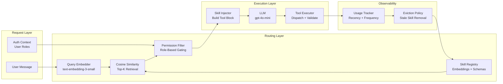
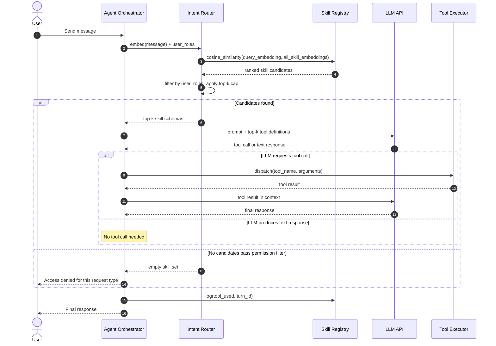

# W3D5 — Dynamic Skill Selection
## AI Engineering Production Playbook | Week 3, Day 5

**Vertical:** Agent Memory & Capabilities
**Series Position:** Day 19 of 28

---

## 1. Overview

Dynamic Skill Selection is the practice of choosing, at inference time, which subset of an agent's registered capabilities to surface to the language model for a given turn. Rather than injecting every available tool into every prompt, the agent runs a fast routing step — semantic similarity, a classifier, or a rule engine — that matches the current user intent to a shortlist of relevant skills. This eliminates thousands of tokens of irrelevant tool definitions from the context window, reduces model confusion, and enforces access control at the capability layer. As production agent systems scale past a dozen tools, static toolsets become the dominant cause of both cost overruns and reasoning failures, making dynamic selection a prerequisite for reliable multi-skill agents.

---

## 2. Learning Objectives

By the end of this document, you will be able to:

1. **Explain** why static tool registration degrades LLM reasoning as tool count grows beyond ten.
2. **Distinguish** between intent-classification routing, embedding-based routing, and rule-based gating as selection strategies.
3. **Implement** a skill registry with embedding-based selection that runs in demo mode without API keys.
4. **Evaluate** the latency and token-cost trade-offs of adding a routing step versus serving the full tool list.
5. **Design** a capability-gated agent that enforces user-role permissions at the skill selection layer.
6. **Apply** eviction policies to prevent stale or unused skills from accumulating in the active skill pool.
7. **Build** a production-ready skill registry with registration, selection, eviction, and observability hooks.
8. **Benchmark** selection accuracy using a held-out intent dataset before deploying to production.

---

## 3. Problem Statement

When an agent has many registered tools, the model receives a long system prompt describing each one. In the OpenAI function-calling format, each tool schema contributes roughly 50–150 tokens. An agent with 30 tools adds 1,500–4,500 tokens of tool definitions to every single request — before a single user token appears. This produces three failure modes:

**Confused selection:** The model sees too many plausible candidates and selects the wrong one. Studies on tool-calling accuracy show measurable accuracy decline when tool count exceeds ~15 candidates in a single context (source: ToolBench, arXiv:2307.16789). Each additional tool increases the probability of misfire.

**Context saturation:** At 4,500 tokens of tool definitions plus conversation history plus system prompt, models operating under 8k or 16k context windows begin losing grip on early-turn instructions — the "lost in the middle" phenomenon covered in W1D2.

**Silent over-privilege:** Loading all tools every turn means the model can invoke high-privilege actions (delete, write, external API calls) even on turns where only a read operation was intended. Principle of least privilege is violated not by intent but by implementation.

The naive fix — remove tools you don't need — doesn't scale. A general-purpose assistant must have all skills registered. The solution is to make skill visibility dynamic: load only what the current intent warrants.

---

## 4. Real-World Scenarios

### Scenario A — The Problem: Enterprise Knowledge Assistant Overloading

A financial services firm deploys a knowledge assistant used by three departments: compliance, trading, and IT support. The agent has 35 registered tools: document search, regulatory lookup, trade execution, portfolio rebalancing, system ticket creation, code deployment, password reset, and more. Every user query — including "What is the vacation policy?" — arrives with all 35 tool definitions in context. On a busy trading day, a compliance analyst asks about position limits. The model, seeing trade execution tools in its context, occasionally attempts to fetch live position data from the trading API — a tool the analyst has no business calling. The compliance team raises a security concern. Separately, the IT team notices the model answering "reset my password" requests by first invoking a regulatory lookup before the password tool, adding 2–3 extra LLM turns per ticket. Average ticket resolution time is 40% higher than expected.

### Scenario B — The Solution: Intent-Routed Skill Selection

The same assistant is refactored with a two-layer architecture. At registration, each tool's description and intended user roles are embedded and stored in a lightweight in-memory vector store. At inference, an intent classifier (a fine-tuned distilbert-base model, latency ~8ms) categorises the incoming query into a domain bucket (compliance, trading, IT). A second step runs cosine similarity over the domain-filtered skill pool and returns the top-5 tools. Only those five tool schemas are injected into the LLM prompt. Trade execution tools are invisible to compliance queries. Password-reset tools are invisible to trading queries. Result: average prompt token count drops from 5,200 to 1,100. Model tool-selection accuracy on an internal benchmark improves from 71% to 94%. Security audit finds zero cross-domain tool invocations in the first month of operation.

---

## 5. Solution Architecture

Dynamic Skill Selection adds a lightweight routing layer between the user request and the LLM call. The architecture has four components:

**Skill Registry** stores every registered capability with its name, description, JSON schema, embedding vector, role permissions, and usage statistics. The registry is the single source of truth for what the agent can do.

**Intent Router** takes the raw user message and produces a ranked list of candidate skills. The router can use any of three strategies — embedding similarity, a classifier, or explicit rules — or a cascade of all three.

**Skill Injector** takes the ranked candidate list, applies permission filters based on the authenticated user's role, and constructs the tool definition block that gets inserted into the LLM prompt. The injector enforces a hard cap (e.g., top-7 tools) to keep token budgets predictable.

**Usage Tracker** records which tools were called on which turns. This data feeds eviction policies (remove tools that haven't been called in N turns) and selection tuning (boost tools that historically get called after this type of intent).

---

## 6. Internal Working Mechanics

### Registration Phase

When a skill is registered, the system:
1. Validates the JSON schema against the target LLM's tool-calling format.
2. Concatenates the skill name and description into a text string.
3. Embeds that string using a small, fast embedding model (e.g., `text-embedding-3-small`).
4. Stores the embedding alongside the schema, permission bitmap, and an empty usage log.

Registration is a one-time cost per skill, not per inference.

### Selection Phase (per inference turn)

1. **Query embedding:** The user's message is embedded using the same model used at registration. Cost: ~100 tokens, ~5ms.
2. **Candidate retrieval:** Cosine similarity is computed between the query embedding and all registered skill embeddings. If the registry has fewer than 50 skills, this is a brute-force dot product — no vector database needed. Above 50 skills, an approximate nearest-neighbour index (e.g., FAISS) reduces retrieval to O(log n).
3. **Permission filtering:** Candidates whose `required_role` does not intersect with the user's roles are dropped from the list before any LLM call.
4. **Top-k selection:** The top-k candidates (default k=5, configurable) pass to the injector.
5. **Fallback:** If cosine similarity scores are all below a threshold (default 0.35), a fallback set of general-purpose tools is used instead of returning an empty tool list.

### Eviction and Decay

Each skill maintains a recency score: a rolling average of how many turns have passed since it was last called. Skills with recency above a threshold (e.g., 50 turns) are flagged as inactive and excluded from similarity search. This prevents accumulating dead skills that dilute search quality over time.

### Edge Cases

- **Ambiguous intent:** When two skills score within 0.05 cosine distance of each other, both are included regardless of the k cap.
- **Multi-turn context:** The router can optionally append the last N turn summaries to the query embedding input, improving accuracy on follow-up questions.
- **Empty result:** If permission filtering removes all candidates, the agent responds with a polite "I don't have access to tools for this request" without an LLM call.

---

## 7. Architecture Diagram



---

## 8. Sequence Diagram



---

## 9. Implementation Guide

### Step 1: Install dependencies

```bash
pip install -r requirements.txt
```

### Step 2: Configure environment

```bash
cp .env.example .env
# Set OPENAI_API_KEY for live mode, or leave blank for demo mode
```

### Step 3: Run the PoC

```bash
# Demo mode — no API key required
DEMO_MODE=true python src/main.py

# Live mode
python src/main.py
```

### Step 4: Understand the core module

The `skill_selection_core.py` module provides three key classes:

**`SkillRegistry`** — registers skills with their descriptions and roles, stores embeddings, and exposes a `select(query, user_roles, top_k)` method.

**`EmbeddingRouter`** — wraps the embedding model call and cosine similarity computation. In demo mode it uses pre-computed mock embeddings.

**`SkillInjector`** — takes a list of `Skill` objects and serialises them into the OpenAI function-calling schema format ready for prompt injection.

### Step 5: Verify with tests

```bash
pytest tests/ -v
# All tests pass offline — no API key needed
```

### Step 6: Extend for production

To add a new skill to the registry:

```python
registry.register(
    name="search_regulations",
    description="Search internal regulatory database for compliance rules",
    schema={...},          # OpenAI tool schema
    required_roles={"compliance", "legal"},
)
```

The embedding is computed once at registration and cached. New skills become selectable immediately.

---

## 10. Benefits & Trade-offs

| Benefit | Trade-off |
|---|---|
| Reduces prompt token count by 60–80% for large tool sets | Adds one embedding call per inference turn (~5–10ms, ~100 tokens) |
| Improves tool-selection accuracy for agents with >10 skills | Routing errors can exclude the correct tool — needs accuracy monitoring |
| Enforces least-privilege access at the capability layer | Permission model must be maintained in sync with IAM/auth system |
| Reduces LLM cost proportionally to tool count reduction | Embedding model has its own cost (~$0.00002/1k tokens for text-embedding-3-small) |
| Enables skill eviction and hot-swap without restarting the agent | Registry state must survive agent restarts — requires persistence layer in production |
| Makes agent behaviour more predictable and auditable | Top-k cap can frustrate users whose request genuinely spans multiple domains |

---

## 11. Performance Characteristics

**Routing latency:** Embedding the user query adds 5–15ms P50 for a hosted model call. For a local model (e.g., a quantised all-MiniLM-L6-v2), this drops to <1ms. Cosine similarity over a registry of 50 skills is O(n) and takes <0.5ms in NumPy.

**Token savings:** With 30 registered tools averaging 120 tokens per schema, static injection costs 3,600 tokens/turn. With top-5 selection, the cost drops to 600 tokens/turn — an 83% reduction. At GPT-4o pricing ($2.50/1M input tokens), this translates to ~$7 saved per 10,000 agent turns.

**Selection accuracy:** ToolBench benchmarks (arXiv:2307.16789) show that embedding-based retrieval achieves ~88% top-1 accuracy and ~97% top-5 accuracy on standard tool-retrieval benchmarks. A domain classifier as a pre-filter can push top-5 accuracy above 99% on well-scoped tool sets.

**Memory footprint:** Storing embeddings for 100 skills at 1,536 dimensions (text-embedding-3-small) costs ~600KB of RAM. This is negligible. FAISS approximate index becomes worthwhile only above ~500 registered skills.

**Throughput:** The routing step is stateless and parallelisable. Under high concurrency, all inference calls can embed queries simultaneously without registry contention.

---

## 12. Security Considerations

**OWASP LLM Top 10 — LLM06: Sensitive Information Disclosure:** Without permission filtering, a user could craft a query embedding that scores highly against a privileged tool (e.g., by embedding a known tool description). Always apply role-based filtering *after* similarity scoring, never before. Pre-filtering by role before similarity search leaks information about which tools exist for which roles.

**OWASP LLM Top 10 — LLM07: Insecure Plugin Design:** Tool schemas injected into the prompt describe the interface of real system actions. Validate all tool arguments against the registered schema before execution — never pass LLM-generated arguments directly to system calls.

**Prompt injection via tool description:** An attacker who can modify skill descriptions in the registry can craft descriptions that score highly against benign queries and then execute privileged actions. Treat the skill registry as a trusted configuration store: access-controlled, version-tracked, and audited.

**Tool name collision:** Two skills with similar names can confuse the model into calling the wrong one. Enforce unique names at registration time and include domain prefixes (e.g., `finance.get_balance` vs `it.reset_password`).

**Embedding model poisoning:** If the embedding model is hosted externally, a MITM attack on the embedding call could alter similarity scores. Use TLS and verify endpoint certificates. For maximum security, use a locally hosted embedding model.

---

## 13. Cost Analysis

**Routing overhead per turn:**
- Query embedding: ~100 tokens × $0.00002/1k = $0.000002 per turn
- At 10,000 turns/day: $0.02/day routing cost

**Token savings per turn (30-tool agent, top-5 selection):**
- Saved: (30 - 5) × 120 tokens = 3,000 tokens/turn
- At GPT-4o input price ($2.50/1M): $0.0075 saved per turn
- At 10,000 turns/day: $75/day saved

**Net benefit:** $75 savings − $0.02 routing overhead = ~$74.98/day net gain at 10,000 turns/day. The routing layer pays for itself at approximately 3 agent turns per day.

**Embedding model choice:** `text-embedding-3-small` ($0.00002/1k tokens) is sufficient for tool routing. `text-embedding-3-large` offers marginally better accuracy but costs 13× more — not justified for this use case.

---

## 14. Best Practices

1. **Embed at registration, not at inference.** Computing skill embeddings once and caching them keeps the per-turn routing cost to a single query embedding call.

2. **Set k conservatively — start at 5.** Most agent tasks require 1–3 tools. A cap of 5 leaves room for multi-step tasks without ballooning the prompt. Increase only after measuring that the cap causes selection misses.

3. **Always include a fallback skill set.** When cosine similarity is low across all candidates (query doesn't match any registered skill), return a set of general-purpose tools rather than an empty list. A bare LLM with no tools can at least respond coherently.

4. **Log which tools were selected and which were called.** Selection accuracy (selected ≠ called) reveals routing drift. When a tool is consistently selected but never called, lower its boost weight. When a tool is needed but not selected, increase k or adjust its description.

5. **Version skill descriptions.** A description change alters the embedding, which changes selection behaviour. Treat description updates as schema migrations: increment version, re-embed, monitor accuracy delta before rolling out.

6. **Apply permission filtering after scoring, not before.** Pre-filtering by role before similarity computation is a timing side-channel: if the filter runs before embedding, query latency reveals which role buckets the user belongs to.

7. **Use domain namespacing in tool names.** Prefix tool names with their domain (`finance.`, `it.`, `hr.`). This prevents name collisions and makes LLM tool calls easier to route back to the correct executor.

8. **Benchmark selection accuracy on real query logs.** Use the first week of production traffic to build a ground-truth dataset of (query → correct tool). Measure top-1 and top-5 accuracy weekly. Set an alert if top-1 drops below 80%.

9. **Cap the registry size.** A registry with 200+ tools suggests the agent has too many responsibilities. Consider splitting into domain-specific sub-agents before adding more tools (this connects to W3D6: Hierarchical Subagent Teams).

10. **Never hardcode tool selection logic for specific users.** Role-based permission filtering must be driven by the authenticated user context passed at inference time — never by hardcoded user IDs in the routing layer.

---

## 15. Anti-Patterns

### The Omniscient Registry
**What it looks like:** Every skill ever built is registered in one global registry. The registry has 80+ tools.
**Why it fails:** Cosine similarity degrades as the candidate pool grows. At 80 tools, many descriptions will share vocabulary, causing spurious high-similarity matches. Top-5 selection becomes unreliable.
**Fix:** Split the registry by domain. Route to a domain registry first, then select within it. Maximum 20–30 tools per domain registry.

### Keyword-Match Pre-Filter
**What it looks like:** Before embedding search, filter candidates by checking if any keyword in the tool description appears in the user's query.
**Why it fails:** Polysemy. "Balance" appears in finance tools (account balance) and IT tools (load balancer). Keyword filters either over-include or under-include.
**Fix:** Use semantic similarity exclusively for candidate retrieval. Keywords are a fragile proxy for intent.

### Static Permission Snapshots
**What it looks like:** User roles are loaded at agent startup and cached for the session lifetime.
**Why it fails:** Role changes (promotion, department transfer, access revocation) take effect only after the user restarts the session. A revoked employee continues to have tool access for hours.
**Fix:** Load user roles from the auth system on every turn, or set a short TTL (e.g., 60 seconds) on the role cache.

### Greedy k Inflation
**What it looks like:** When a task fails, developers increase k to "make sure the right tool is always included."
**Why it fails:** k=15 defeats the purpose of dynamic selection. You're back to injecting most of the tool list.
**Fix:** When a tool is missed at k=5, diagnose the routing failure. Is the description too generic? Is the query embedding too short? Fix the description or add a query expansion step. Don't inflate k.

### Description Neglect
**What it looks like:** Tool descriptions are one-liners written at development time and never updated: "Searches the database."
**Why it fails:** Vague descriptions produce low cosine similarity scores against specific user queries. The correct tool ranks 8th when a good description would have ranked it 1st.
**Fix:** Write descriptions that match the language users actually use. Include example queries in the description: "Use this to find customer orders, purchase history, or order status. Example: 'Where is my order?'"

### Missing Fallback
**What it looks like:** When no tool scores above the similarity threshold, the agent returns an error or crashes.
**Why it fails:** Low-similarity queries are often the most important ones — edge cases and novel requests that don't closely match any registered tool description.
**Fix:** Always define a fallback skill set (e.g., a general-purpose text response tool) that activates when similarity is universally low.

---

## 16. Common Mistakes

### Mistake 1: Embedding the tool name instead of the description
**Symptom:** A tool named `get_cx_order_v3` never gets selected even for "where is my order?" queries.
**Root cause:** The developer embedded only the tool name, not its natural-language description. Short, technical names have poor semantic overlap with conversational queries.
**Fix:** Always embed the full description. Include example user queries in the description string.

### Mistake 2: Using different embedding models at registration and inference
**Symptom:** Selection accuracy is randomly poor — some tools are always selected, others never.
**Root cause:** Embeddings from model A and model B live in different vector spaces. Cosine similarity across spaces is meaningless.
**Fix:** Lock the embedding model name in config. If you need to upgrade the model, re-embed the entire registry and run an accuracy check before switching in production.

### Mistake 3: Not handling empty tool results
**Symptom:** Agent crashes or returns a generic error when the user asks something outside the registered skill domain.
**Root cause:** The code path for `selected_skills == []` was never implemented.
**Fix:** Always test the zero-match path. Return a graceful "I can't help with that" response or route to a human-handoff tool.

---

## 17. Production Checklist

- [ ] Skill descriptions written in natural language matching user query patterns
- [ ] Embedding model name pinned in config — same model at registration and inference
- [ ] All skill embeddings pre-computed and cached — not recomputed per turn
- [ ] Top-k cap enforced with a hard ceiling in config (not hardcoded in logic)
- [ ] Permission filtering applied after similarity scoring
- [ ] User roles loaded per-turn from auth system (not cached at session start)
- [ ] Fallback skill set defined for low-similarity queries
- [ ] Selection accuracy monitored weekly with a ground-truth query dataset
- [ ] Alert configured when top-1 accuracy drops below 80%
- [ ] Tool usage logged (tool name, user ID, turn ID, was it called after selection)
- [ ] Eviction policy configured — stale skills automatically excluded from search
- [ ] Skill registry version-controlled — descriptions treated as schema migrations
- [ ] Tool argument validation enforced before execution (not trusting LLM output directly)
- [ ] Registry size capped — alert if total registered skills exceeds domain threshold
- [ ] Load test: verify routing latency stays under 20ms at peak QPS

---

## 18. References

[1] Qin, Y. et al. (2023). "ToolLLM: Facilitating Large Language Models to Master 16000+ Real-world APIs." arXiv:2307.16789. https://arxiv.org/abs/2307.16789

[2] OpenAI (2024). "Function Calling Documentation." https://platform.openai.com/docs/guides/function-calling

[3] aurelio-ai (2024). "Semantic Router — Production-ready routing for LLM applications." GitHub. https://github.com/aurelio-ai/semantic-router

[4] LangChain (2024). "Tool Selection and Routing." https://python.langchain.com/docs/how_to/tool_calling/

[5] Johnson, J., Douze, M., & Jégou, H. (2019). "Billion-scale similarity search with GPUs." IEEE Transactions on Big Data. arXiv:1702.08734. https://arxiv.org/abs/1702.08734

[6] OWASP (2025). "OWASP Top 10 for Large Language Model Applications." https://owasp.org/www-project-top-10-for-large-language-model-applications/

---

## 19. Summary

Dynamic Skill Selection solves a scaling problem that every production agent team eventually hits: as you add tools to an agent, you make it simultaneously more capable and less reliable. The core insight is that the toolset itself is a context window management problem. By treating skill selection as a retrieval step — embedding descriptions once, scoring intent at inference, filtering by permission, and injecting only what is relevant — you recover the token budget, improve routing accuracy, and enforce least-privilege access all at once. The routing overhead (one embedding call, ~10ms) is almost always worth the savings in tool-definition tokens and the accuracy improvement that comes from a focused tool list. Done right, the skill registry becomes a first-class architectural component: versioned, monitored, and as carefully maintained as the skills themselves.

---

## 20. Exercises

**Beginner:** Run the PoC in demo mode (`DEMO_MODE=true python src/main.py`). Inspect `sample_input.json`. Change the query to "reset my password" and observe which skills are selected. Does the selection change?

**Intermediate:** Register three additional skills in `skill_selection_core.py` with different domain descriptions. Run the PoC and verify that query routing changes based on the new descriptions. What happens when two skills have nearly identical descriptions?

**Advanced:** Replace the mock embedding in demo mode with a real call to `text-embedding-3-small`. Measure how selection accuracy on 10 hand-crafted queries compares to the cosine thresholds used in the demo. Tune the threshold and document the precision/recall trade-off.

**Expert:** Add a usage-tracking layer that records which tools are selected and which are actually called. After 50 simulated turns, compute the selection-to-call ratio for each tool. Identify tools that are frequently selected but rarely called — these are candidates for description refinement. Update their descriptions and measure if the ratio improves.

**Research:** Read the ToolLLM paper (arXiv:2307.16789). The paper introduces a depth-first search-based decision tree (DFSDT) for tool selection. How does this approach compare to embedding-based top-k retrieval? In what scenario would DFSDT outperform cosine similarity routing?

---

## 21. Interview Questions

1. **Conceptual:** Explain Dynamic Skill Selection to a product manager who asks why you can't just give the agent all 50 tools at once.

2. **Technical:** Walk me through what happens between the moment a user sends a message and the moment the LLM receives its tool list in a dynamic selection system. Name each component.

3. **Design:** You need to build a dynamic skill selection system for an agent that serves both enterprise customers (100+ tools per tenant) and individual users (5–10 tools). How does your registry and routing architecture differ between these two cases?

4. **Trade-off:** When would you choose a lightweight intent classifier over an embedding-based router for skill selection? What are the latency, accuracy, and maintenance trade-offs?

5. **Debugging:** A production agent consistently fails to select the correct tool for "cancel my subscription" queries, even though a `cancel_subscription` tool is registered. The tool scores 0.31 cosine similarity against the query. What are three possible root causes and how do you fix each?

6. **Security:** A security audit finds that your skill selection system loads user roles once at session start. Explain the vulnerability this creates and the correct fix.

7. **Scaling:** Your skill registry currently has 40 tools and brute-force cosine similarity takes 0.5ms. The product roadmap calls for 500 tools within 6 months. At what point should you introduce an approximate nearest-neighbour index, and what trade-off does this introduce?

8. **Production:** Your top-1 selection accuracy drops from 91% to 74% over a two-week period without any code changes. What are the most likely causes and how do you diagnose them?

9. **Architecture:** How would you integrate Dynamic Skill Selection with the Hierarchical Subagent Teams pattern covered in W3D6? Specifically, does each subagent maintain its own registry, or is there a shared registry with role-based views?

10. **Conceptual:** Why is cosine similarity between query embedding and tool description embedding a reasonable proxy for intent-to-tool relevance? What assumption does this make about the embedding space, and when does that assumption break down?
