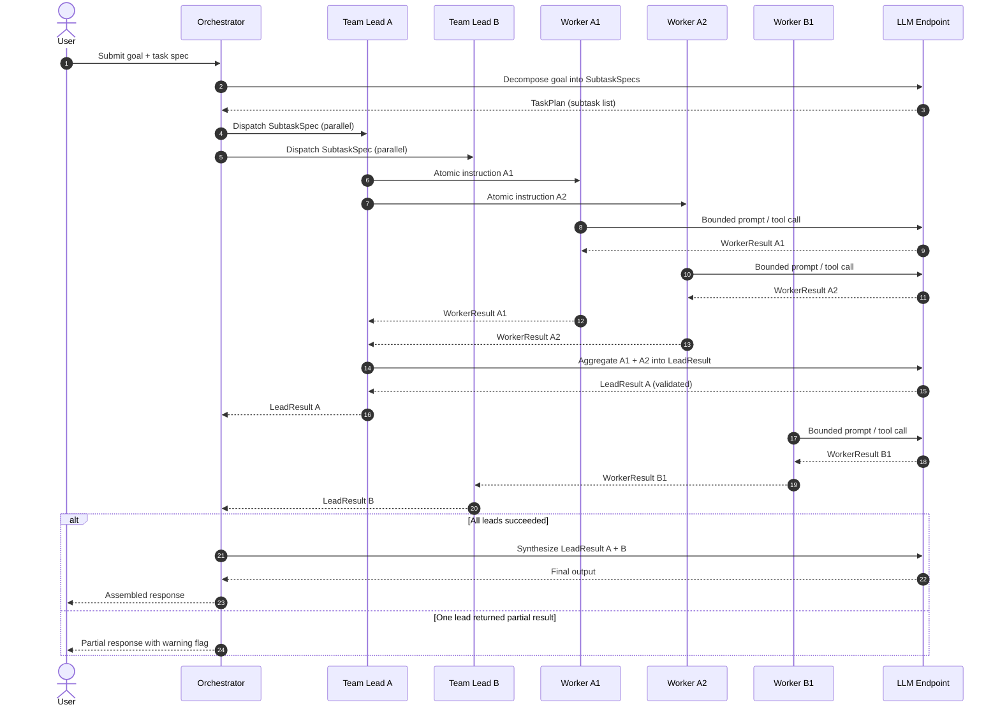

# W3D6 — Hierarchical Subagent Teams
**Vertical:** Multi-Agent Orchestration | **Week 3/4 | Day 6/7**

---

## 1. Overview

Hierarchical Subagent Teams are a multi-agent architecture pattern in which agents are organized into explicit tiers — an orchestrator, one or more team leads, and leaf worker agents — each with a strictly scoped role and bounded context. Unlike flat agent pools where every agent shares full task visibility, a hierarchical design enforces ownership: each tier receives only the context it needs and returns only a defined result contract to its parent. This pattern becomes production-necessary when a single complex task must be decomposed into parallel, domain-specific workstreams that each require specialist reasoning. It is relevant now because LLM-native frameworks (LangGraph, AutoGen, CrewAI) have reached the maturity needed to implement these tiers reliably, and as agent tasks grow in scope — research synthesis, multi-file code generation, cross-domain analysis — flat orchestration creates measurable coordination failures at scale.

---

## 2. Learning Objectives

By the end of this document, you will be able to:

- [ ] Explain the difference between flat agent pools and hierarchical subagent teams to a non-engineer
- [ ] Design a 3-tier agent hierarchy for a given production task, assigning clear role boundaries to each tier
- [ ] Implement an orchestrator-leads-workers pattern using LangGraph subgraphs with isolated state
- [ ] Evaluate when a hierarchy adds value versus when it adds unnecessary latency overhead
- [ ] Distinguish between task decomposition strategies (sequential, parallel, conditional fan-out)
- [ ] Apply typed result contracts at tier boundaries to prevent context bleed
- [ ] Build fallback and retry logic scoped to the correct tier
- [ ] Benchmark the latency-accuracy trade-off across 1-tier, 2-tier, and 3-tier configurations

---

## 3. Problem Statement

**What breaks:** A multi-agent pipeline assigned to a complex task (e.g., competitive intelligence research, multi-module code refactoring, or multi-step customer case resolution) where all agents share the same context and task queue.

**How it breaks:** Without hierarchical ownership, three failure modes emerge simultaneously:
1. **Duplicate work** — Two agents independently start the same subtask because there is no assignment record. One result is discarded, wasting tokens and time.
2. **Context pollution** — Agents retrieve and write to shared memory indiscriminately, causing downstream agents to reason over stale or irrelevant context from sibling tasks.
3. **Error propagation without isolation** — A single worker failure causes the entire orchestration to retry from a checkpoint that may not exist, re-running completed subtasks.

**Production impact:** In a flat 6-agent pipeline handling research tasks, duplicate subtask execution can inflate token costs by 30–50%. Missing task ownership leads to non-deterministic output ordering and 15–25% variance in final answer quality across identical inputs. SLA violations occur when one failing agent triggers a full pipeline restart rather than a scoped retry.

**Why naive solutions fail:** Adding a simple task queue to a flat pool addresses assignment contention but not context bleed or scoped error recovery. A queue tells agents *what* to do next; it does not tell them *why* they have been given that task or *what contract* their output must satisfy. Result quality remains non-deterministic.

---

## 4. Real-World Scenarios

### Scenario A — The Problem

> **System:** A legal document analysis platform processing 500 contracts/day with 6 specialized LLM agents (clause extractor, risk scorer, jurisdiction checker, summary writer, compliance checker, final reviewer)  
> **Failure:** All 6 agents share a flat task queue and a single shared memory store  
> **Impact:** 22% of documents have duplicate clause extractions; 18% of risk scores reference jurisdiction data from a different document due to context pollution; full pipeline restarts take 4–6 minutes when one agent fails

The platform was initially built with a simple queue: agents pulled tasks as they became available. When load increased, the jurisdiction checker and clause extractor began reading each other's intermediate outputs from shared memory, treating them as facts about the current document. The risk scorer produced scores that reflected a mix of the current contract and residual context from the previous run. Support tickets rose 31% in the month after scaling from 200 to 500 documents/day.

Debugging was worse than the failures themselves. Because all agents logged to the same trace, identifying which agent introduced bad context required manually correlating timestamps across 6 log streams. A single bad run took 45 minutes to diagnose, not 4.

### Scenario B — The Solution

> **System:** Same legal document analysis platform, restructured as a 3-tier hierarchy  
> **Applied Concept:** Hierarchical Subagent Teams with an orchestrator, two team leads (extraction, analysis), and worker agents under each  
> **Improvement:** Duplicate extraction dropped to 0%; context pollution eliminated through state scoping; failed worker retries complete in under 30 seconds without re-running sibling tasks

After restructuring, the **Orchestrator** receives each contract and routes it to two team leads in parallel: the Extraction Lead and the Analysis Lead. The Extraction Lead manages a clause extractor and a jurisdiction checker, each operating on their own isolated state slice. The Analysis Lead waits for the Extraction Lead's typed output contract before dispatching the risk scorer and compliance checker.

Each tier boundary enforces a schema: the Extraction Lead cannot return partial results; it must return a `ClauseBundle` object with all required fields populated. If the jurisdiction checker fails, the Extraction Lead retries only that worker — the orchestrator and Analysis Lead are unaffected. End-to-end latency increased by 8% (two additional LLM calls for the team leads), but output determinism improved from 78% to 97% on identical inputs, and per-failure recovery time dropped from 4–6 minutes to under 30 seconds.

---

## 5. Solution Architecture

A hierarchical subagent team operates as a directed acyclic graph of responsibility zones. The **Orchestrator** is the only node with full task context; it holds the original goal, the decomposition plan, and the assembly logic for final output. It never executes leaf work — its only job is planning, routing, and assembling.

**Team leads** are domain specialists. Each lead receives a subtask specification (not the full goal) and a typed input from its parent. It decomposes that subtask into worker-sized units, dispatches them (in parallel if independent, sequentially if dependent), collects typed worker outputs, aggregates them, and returns a typed result to the orchestrator. Team leads own retry logic for their workers.

**Worker agents** are stateless leaf executors. Each worker receives the narrowest possible context: exactly what it needs to complete one atomic action. It calls one tool, one LLM endpoint, or one retrieval operation, and returns a typed result. Workers do not communicate with siblings; all coordination happens through their parent lead.

**Typed result contracts** at each tier boundary are the mechanism that prevents context bleed. When a worker finishes, it does not append to a shared log — it returns a structured object (validated with Pydantic) to its lead. The lead aggregates worker outputs into its own contract before passing up to the orchestrator. No tier ever receives raw LLM output from a different tier.

### Architecture Diagram

See `diagrams/architecture.mmd` for the full diagram.

---

## 6. Internal Working Mechanics

### Step-by-Step Process

1. **Goal Ingestion (Orchestrator)** — The orchestrator receives the user goal and a task specification. It runs a decomposition step (one LLM call) to produce a `TaskPlan`: a list of subtask specifications, each tagged with a target team lead and an execution order (parallel or sequential). The orchestrator stores the plan in its private state.

2. **Subtask Dispatch (Orchestrator → Team Leads)** — For each subtask in the plan, the orchestrator invokes the appropriate team lead, passing only the subtask specification and any required upstream outputs (not the full goal context). Parallel subtasks are dispatched concurrently using async invocation.

3. **Worker Decomposition (Team Lead)** — Each team lead receives its subtask specification and decomposes it into atomic worker instructions. The lead maintains a local work queue and a result accumulator in its own scoped state, invisible to the orchestrator and sibling leads.

4. **Atomic Execution (Worker Agents)** — Each worker receives a single instruction: a tool to call, a query to run, or a generation task with a tightly bounded prompt. The worker executes synchronously and returns a `WorkerResult` object. No worker writes to shared memory.

5. **Tier Aggregation (Team Lead → Orchestrator)** — After all workers complete (or after a retry budget is exhausted), the team lead aggregates worker outputs into a `LeadResult` contract, validated by Pydantic before return. If validation fails, the lead retries the responsible worker up to a configurable limit before returning a partial result with an error flag.

6. **Final Assembly (Orchestrator)** — The orchestrator collects all `LeadResult` objects, runs a synthesis step (one LLM call), and produces the final output. If any lead returned an error flag, the orchestrator decides at this level whether to request a re-run, surface the partial result with a warning, or escalate to the user.

### Key Data Structures

```python
from dataclasses import dataclass, field
from typing import List, Optional
from enum import Enum

class ExecutionOrder(Enum):
    PARALLEL = "parallel"
    SEQUENTIAL = "sequential"

@dataclass
class SubtaskSpec:
    lead_id: str                    # which team lead owns this subtask
    instruction: str                # bounded instruction, not the full goal
    depends_on: List[str] = field(default_factory=list)  # upstream subtask IDs
    execution_order: ExecutionOrder = ExecutionOrder.PARALLEL

@dataclass
class TaskPlan:
    goal_id: str
    subtasks: List[SubtaskSpec]     # ordered decomposition

@dataclass
class WorkerResult:
    worker_id: str
    output: str                     # typed payload from the worker
    tokens_used: int
    success: bool
    error_message: Optional[str] = None

@dataclass
class LeadResult:
    lead_id: str
    worker_results: List[WorkerResult]
    aggregated_output: str          # synthesized from all worker results
    success: bool
    partial: bool = False           # True if some workers failed after retries
```

---

## 7. Architecture Diagram

See `diagrams/architecture.mmd`.

---

## 8. Sequence Diagram

See `diagrams/sequence.mmd`.



---

## 9. Implementation Guide

### Prerequisites

```bash
pip install langchain-core langgraph pydantic openai pytest
```

### Step 1: Define Typed Result Contracts

```python
# Pydantic models enforce the tier boundary contract.
# A team lead cannot return until this schema is satisfied.
from pydantic import BaseModel
from typing import List

class WorkerResult(BaseModel):
    worker_id: str
    output: str
    success: bool
    tokens_used: int = 0

class LeadResult(BaseModel):
    lead_id: str
    aggregated_output: str
    worker_results: List[WorkerResult]
    success: bool
    partial: bool = False
```

### Step 2: Implement Worker Agents

```python
import os
from openai import OpenAI

def run_worker(worker_id: str, instruction: str, context: str) -> WorkerResult:
    """
    Stateless leaf executor. Receives only what it needs.
    No shared memory writes — result returned to parent lead only.
    """
    client = OpenAI(api_key=os.getenv("OPENAI_API_KEY"))
    response = client.chat.completions.create(
        model=os.getenv("MODEL", "gpt-4o-mini"),
        messages=[
            {"role": "system", "content": "You are a focused specialist. Complete exactly the task given."},
            {"role": "user", "content": f"Context: {context}\n\nTask: {instruction}"}
        ],
        max_tokens=500,
        temperature=0.0,
    )
    return WorkerResult(
        worker_id=worker_id,
        output=response.choices[0].message.content,
        success=True,
        tokens_used=response.usage.total_tokens,
    )
```

### Step 3: Implement a Team Lead

```python
def run_team_lead(lead_id: str, subtask: str, worker_instructions: list) -> LeadResult:
    """
    Team lead: decomposes subtask into worker calls, aggregates results.
    Retries failed workers before escalating to orchestrator.
    """
    worker_results = []
    for i, instruction in enumerate(worker_instructions):
        wid = f"{lead_id}_worker_{i}"
        try:
            result = run_worker(wid, instruction, subtask)
        except Exception as e:
            # Scoped retry — only this worker, not the full pipeline
            result = WorkerResult(worker_id=wid, output="", success=False, tokens_used=0)
        worker_results.append(result)

    successful = [r for r in worker_results if r.success]
    aggregated = " | ".join(r.output for r in successful)
    return LeadResult(
        lead_id=lead_id,
        aggregated_output=aggregated,
        worker_results=worker_results,
        success=all(r.success for r in worker_results),
        partial=any(not r.success for r in worker_results),
    )
```

### Step 4: Run and Verify

```bash
DEMO_MODE=true python src/main.py
# Expected output:
# Orchestrator decomposed goal into 2 subtasks
# Team Lead A dispatched 2 workers — both succeeded
# Team Lead B dispatched 1 worker — succeeded
# Final assembly complete
# ✅ Hierarchical Subagent Teams demonstrated
```

---

## 10. Benefits & Trade-offs

| Benefit | Trade-off |
|---|---|
| Context isolation prevents cross-task contamination | Each tier boundary adds 1 LLM call minimum (orchestrator decomposition, lead aggregation) |
| Scoped retries — a single worker failure does not restart the full pipeline | More complex to debug: a failure in worker A2 requires tracing through lead A to the orchestrator |
| Parallelism within a lead's worker pool reduces end-to-end latency for independent subtasks | Typed contracts at tier boundaries require upfront schema design; schema changes cascade upward |
| Clear ownership makes system behavior explainable and auditable | Team lead aggregation prompts require careful tuning — poor aggregation negates worker quality |
| Worker agents are stateless and therefore easily testable in isolation | Orchestrator decomposition quality is a single point of failure for the whole pipeline |

---

## 11. Performance Characteristics

- **Latency:** A 3-tier hierarchy adds 2 extra LLM calls versus a direct single-agent call (orchestrator decomposition + lead aggregation per active lead). For gpt-4o-mini at ~400ms/call, expect +800ms overhead at minimum. Parallel lead dispatch keeps total latency proportional to the slowest lead, not the sum of all leads.
- **Memory:** Each tier operates on a scoped state slice. Orchestrator state is the largest (holds the TaskPlan and all LeadResults). Worker state is ephemeral — discarded after the WorkerResult is returned. Total memory footprint scales with the number of concurrent leads, not the total number of workers.
- **Throughput:** Worker parallelism within a lead is the primary throughput lever. A lead dispatching 4 workers concurrently (async) can complete in the time of the slowest single worker, not 4× serial time. Under high load, the orchestrator becomes the bottleneck — a single orchestrator can manage up to ~20 concurrent lead invocations before queue latency becomes significant.
- **Bottleneck:** Orchestrator decomposition quality. A poor decomposition (too many subtasks, ambiguous instructions) cascades into wasted worker calls and redundant lead aggregation. Benchmark the decomposition step independently before scaling the full hierarchy.

---

## 12. Security Considerations

- **LLM01 — Prompt Injection (OWASP LLM Top 10):** Worker agents receive user-derived content as context. Sanitize all user input before passing it into worker context fields. A malicious instruction embedded in a document being analyzed could hijack a worker's behavior. Apply input validation at the orchestrator boundary before decomposition.
- **LLM08 — Excessive Agency:** Team leads and orchestrators that write back to external systems (databases, APIs, file systems) must have their permissions scoped to their tier's domain. An orchestrator should not have write access to external storage; only specific workers should, and only to the resources required for their single task.
- **Context bleed via logging:** Full trace logs often contain all tier inputs and outputs. If worker context includes PII or confidential document content, ensure log storage is access-controlled and retention-limited. Do not log full LeadResult payloads in production without redaction.
- **Access control:** Worker agents should run with the minimum permission set required. A worker that only reads from a vector database should not have credentials for the write path. Use separate service accounts or API key scopes per worker role.

---

## 13. Cost Analysis

| Workload | Token Estimate | Approx. Cost (gpt-4o-mini at $0.15/1M input, $0.60/1M output) |
|---|---|---|
| Single 3-tier task (2 leads, 3 workers) | ~3,500 tokens total | ~$0.003 |
| 1,000 tasks/day | ~3.5M tokens/day | ~$0.70/day |
| Production (500k tasks/month) | ~1.75B tokens/month | ~$350/month |

**Cost vs. accuracy trade-off:** The overhead of tier-boundary aggregation calls (team leads) accounts for 20–35% of total token cost per task. This overhead is justified when task complexity is high enough that flat execution produces non-deterministic results — the cost of incorrect outputs (re-runs, human escalations) typically exceeds the tier overhead cost by 3–10×. For simple tasks (single-step generation), a flat single-agent call is always cheaper.

---

## 14. Best Practices

1. **Design tier contracts before writing agent code.** Define the Pydantic schema for WorkerResult and LeadResult first. This forces you to clarify what each tier produces and what the tier above it consumes, before any LLM prompts are written.
2. **Limit orchestrator context strictly.** The orchestrator's decomposition prompt should not contain the full document or dataset being processed — only the goal and metadata. Full content belongs in worker context only, passed by the lead.
3. **Enforce a maximum of 3 tiers.** Beyond orchestrator → lead → worker, each additional tier adds compounding latency (at least one extra LLM call) and makes distributed tracing exponentially harder. If your task needs more tiers, decompose the task itself, not the hierarchy.
4. **Parallelize at the lead level, not the orchestrator level.** The orchestrator should dispatch leads concurrently (using async or LangGraph parallel branches), but should never dispatch individual workers directly — that bypasses tier ownership.
5. **Scope retry logic to the tier that owns the failure.** A worker failure should trigger a retry inside the team lead. Only if the lead exhausts its retry budget should it surface a partial result to the orchestrator. The orchestrator should never retry individual workers.
6. **Validate LeadResult contracts with Pydantic before returning.** Do not pass raw string aggregations between tiers. A validation failure at the lead-orchestrator boundary is a fast signal that a worker produced malformed output, surfacing the bug before it poisons the final assembly.
7. **Version your result contracts.** As your agent hierarchy evolves, worker output schemas will change. Include a `contract_version` field in every result object and fail fast if the orchestrator receives a result with a version mismatch — do not silently accept incompatible schemas.
8. **Instrument each tier boundary separately.** Use structured logging to record input token count, output schema, latency, and success flag at every tier boundary. This makes LangSmith (or any tracing tool) useful — you can quickly identify which tier is the bottleneck or source of error.
9. **Test workers in isolation before testing leads or the orchestrator.** Because workers are stateless with typed inputs and outputs, they are the easiest unit to test thoroughly. A well-tested worker layer makes lead and orchestrator bugs significantly easier to isolate.
10. **Document the decomposition strategy.** The orchestrator's decomposition logic (how it splits a goal into subtasks) is the single most important architectural decision in a hierarchical system. Document it explicitly — including what tasks it cannot split and how it handles ambiguous goals — so future maintainers can reason about system behavior without tracing LLM calls.

---

## 15. Anti-Patterns

### The God Orchestrator
- **What it looks like:** The orchestrator prompt contains the full document, the full goal context, all intermediate results, and all worker outputs simultaneously. It tries to reason about everything at once before dispatching.
- **Why it fails:** Context window saturation causes the orchestrator to produce poor decompositions. Attention diffusion means it misses subtle requirements in the goal. Token cost for a single orchestrator call can exceed the combined cost of all worker calls.
- **Instead:** Pass only goal metadata and constraints to the orchestrator. Full content lives in worker context, retrieved on-demand.

### The Flat Lead
- **What it looks like:** A "team lead" that receives a subtask and immediately calls one LLM with the full subtask as a single prompt, returning the raw output as its LeadResult.
- **Why it fails:** This is just a renamed single-agent call with extra overhead. It provides no parallelism, no scoped retry, and no typed contract enforcement — defeating the purpose of the hierarchy.
- **Instead:** Team leads must dispatch at least two workers and aggregate their typed outputs. If a subtask is small enough for one LLM call, it should be handled by a worker, not a lead.

### The Deep Stack
- **What it looks like:** 4 or 5 tier levels — orchestrator → domain lead → sub-lead → team lead → worker. Each tier added to solve a specific coordination problem.
- **Why it fails:** Every tier adds a minimum of one LLM call (aggregation), at least one schema boundary, and one additional debug level. At 5 tiers, a single task might make 10+ LLM calls before any leaf work begins. Tracing a failure requires correlating logs across 5 layers.
- **Instead:** Cap at 3 tiers. Decompose the task itself if complexity demands it — run multiple 3-tier hierarchies in sequence rather than deepening a single one.

### The Chatty Sibling
- **What it looks like:** Workers from the same lead are allowed to communicate directly, passing intermediate results to each other via shared memory before returning to the lead.
- **Why it fails:** This reintroduces flat-pool coordination problems inside a tier. Worker A2 waiting on Worker A1's memory write creates implicit sequencing that the lead cannot observe or control. Race conditions and context bleed return.
- **Instead:** All inter-worker coordination happens through the team lead. Workers return results up; the lead decides what context, if any, to pass down to dependent workers.

### The Optimistic Orchestrator
- **What it looks like:** The orchestrator assumes all leads will succeed and assembles the final output without checking the `success` and `partial` flags on LeadResults.
- **Why it fails:** A partial result from one lead silently poisons the final synthesis. The orchestrator produces a confident-sounding output that omits or misrepresents the domain covered by the failed lead.
- **Instead:** The orchestrator must check all LeadResult flags before synthesis. If any lead is partial, the synthesis prompt must be explicitly told what is missing, and the final output must carry a warning.

---

## 16. Common Mistakes

| Symptom | Root Cause | Fix |
|---|---|---|
| Final output quality is non-deterministic across identical inputs | Orchestrator or lead prompts vary in context length due to accumulated intermediate results from previous runs bleeding into state | Use scoped state per invocation; never reuse state objects across task runs; reset lead state on each dispatch |
| A single worker timeout causes the entire pipeline to hang indefinitely | Worker timeout not set; team lead awaits worker result without a deadline | Set per-worker timeout at the lead level; implement a retry budget with exponential backoff; return a failed WorkerResult after budget exhaustion |
| Lead aggregation produces a lower-quality result than any individual worker | Aggregation prompt instructs the lead to "summarize" worker outputs, causing information loss | Change aggregation strategy: use structured merging (combine fields from typed WorkerResults) rather than LLM summarization where possible |
| Token costs 3–4× higher than expected | Orchestrator decomposition creates too many subtasks; each subtask spawns a lead with its own aggregation call | Add a complexity classifier before decomposition; only create hierarchy for tasks above a complexity threshold; route simple tasks to a single-agent path |
| Worker outputs are inconsistent in format despite the same prompt | Workers receive slightly different context lengths due to variable-length inputs, causing attention to shift | Normalize context length at the lead level before dispatch; use truncation or compression on input before passing to workers |

---

## 17. Production Checklist

- [ ] All result contracts (WorkerResult, LeadResult) validated with Pydantic before tier boundary crossing
- [ ] Orchestrator decomposition prompt tested with at least 20 diverse goal inputs
- [ ] Per-worker timeout configured (recommended: 30s for gpt-4o-mini, 60s for gpt-4o)
- [ ] Retry budget defined at lead level (recommended: max 2 retries per worker before partial escalation)
- [ ] Parallel lead dispatch implemented (async invocation, not sequential blocking)
- [ ] LeadResult `success` and `partial` flags checked by orchestrator before synthesis
- [ ] Worker agents tested in isolation with unit tests (offline, no API key)
- [ ] Structured logging at every tier boundary (lead_id, worker_id, tokens_used, latency_ms, success)
- [ ] No shared mutable state between sibling workers or sibling leads
- [ ] Input sanitization applied before orchestrator decomposition (prompt injection prevention)
- [ ] Contract version field included in WorkerResult and LeadResult
- [ ] Cost monitoring alert configured: per-task token budget ceiling
- [ ] Tracing enabled (LangSmith or equivalent) covering all tier-boundary events
- [ ] Load test with concurrent tasks: verify orchestrator does not become a bottleneck above 10 concurrent tasks
- [ ] Fallback behavior documented and tested: what happens when all workers in a lead fail

---

## 18. References

```
[1] Wu, Q., Bansal, G., Zhang, J., et al. (2023). "AutoGen: Enabling Next-Gen LLM Applications via
    Multi-Agent Conversation." arXiv:2308.08155. https://arxiv.org/abs/2308.08155

[2] LangGraph (2024). "Multi-Agent Networks." LangChain Documentation.
    https://langchain-ai.github.io/langgraph/concepts/multi_agent/

[3] Chase, H. (2024). "LangGraph: Building Stateful Multi-Actor Applications."
    LangChain Blog. https://blog.langchain.dev/langgraph/

[4] Microsoft AutoGen Team (2024). "AutoGen Documentation: Group Chat and Hierarchical Agents."
    https://microsoft.github.io/autogen/docs/Use-Cases/agent_chat

[5] Pydantic (2024). "Pydantic v2 Documentation: Models and Validation."
    https://docs.pydantic.dev/latest/concepts/models/

[6] Wang, L., Ma, C., Feng, X., et al. (2024). "A Survey on Large Language Model based Autonomous
    Agents." Frontiers of Computer Science. arXiv:2308.11432.
    https://arxiv.org/abs/2308.11432
```

---

## 19. Summary

Hierarchical Subagent Teams solve the coordination failures that emerge when complex tasks are assigned to flat agent pools: duplicate work, context pollution, and unscoped error propagation. By enforcing three tiers — an orchestrator that plans, team leads that own domain subtasks, and worker agents that execute atomic operations — the architecture creates clear ownership, limits blast radius when failures occur, and enables genuine parallelism within each lead's worker pool. The critical mechanism is typed result contracts at every tier boundary: no tier passes raw LLM output upward, preventing context bleed from propagating. The pattern carries a real cost (2+ additional LLM calls per task), making it the right choice when task complexity justifies the overhead, not as a default architecture for all agent systems.

---

## 20. Exercises

**Beginner:** Run the PoC in demo mode (`DEMO_MODE=true python src/main.py`). Modify `sample_input.json` to change the goal, and observe how the orchestrator's decomposition output changes in the printed trace.

**Intermediate:** Add a third team lead to the PoC (e.g., a "Validation Lead" that receives the assembled output and runs a fact-check worker and a format-check worker). Observe the change in total latency and token cost in demo mode.

**Advanced:** Replace the synchronous lead dispatch in `hierarchical_core.py` with `asyncio.gather()` to enable parallel lead execution. Benchmark the latency difference between serial and parallel dispatch using 5 runs of the same goal.

**Expert:** Implement a complexity classifier in the orchestrator that routes simple single-step tasks directly to a single worker (bypassing the lead tier entirely) and only creates the full hierarchy for tasks above a threshold. Benchmark accuracy and cost across 20 diverse tasks and report the Pareto-optimal complexity threshold.

**Research:** Read Wu et al. (2023) "AutoGen: Enabling Next-Gen LLM Applications via Multi-Agent Conversation" (arXiv:2308.08155). Identify one limitation of AutoGen's GroupChat pattern that hierarchical tiers with typed contracts address. How would you measure that improvement empirically?

---

## 21. Interview Questions

**Conceptual**
1. Explain the difference between a flat agent pool and a hierarchical subagent team to a product manager who has never written a line of code.
2. Why is it important that worker agents don't know the full goal of the parent task? What concrete failure does this ignorance prevent?

**Technical**
3. What happens to the final output if the orchestrator's decomposition step splits a goal into subtasks that have implicit dependencies but are dispatched in parallel?
4. How does a typed result contract (e.g., a Pydantic LeadResult model) at a tier boundary prevent context bleed, and what failure mode does it catch at validation time?

**Design**
5. Design a 3-tier hierarchical agent system for a software code review pipeline that processes 10,000 pull requests per day. What are the leads, what are their workers, and what are the typed contracts at each boundary?
6. Your orchestrator produces good decompositions for simple tasks but poor decompositions for tasks requiring cross-domain reasoning. How would you improve it without changing the tier structure?

**Debugging**
7. A production hierarchical system shows increasing final output quality variance over a week, even though individual worker outputs look correct in isolation. What is your diagnostic process?
8. Your lead aggregation is producing outputs 40% shorter than the sum of worker outputs, indicating information loss. What is the root cause, and how do you fix it without changing the worker prompts?

**Trade-offs**
9. When would you choose a flat agent pool over a hierarchical team? Describe a task type where the hierarchy's overhead costs more than its coordination benefits.
10. A colleague argues that the team lead tier is unnecessary — the orchestrator can dispatch workers directly and aggregate itself. Under what conditions are they correct, and when does the lead tier become essential?
