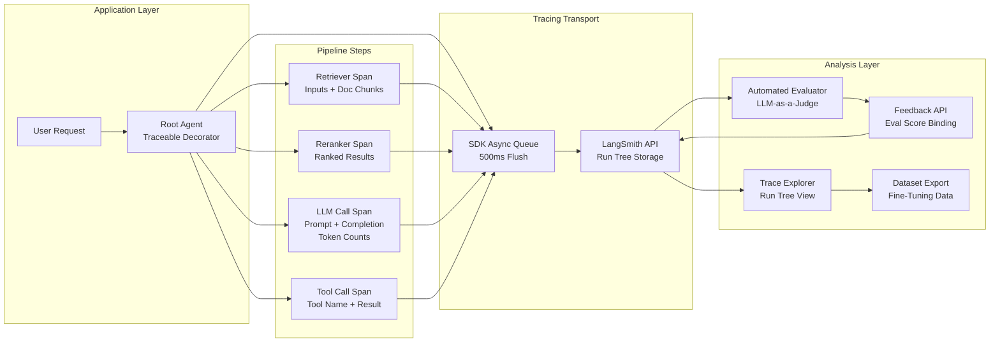
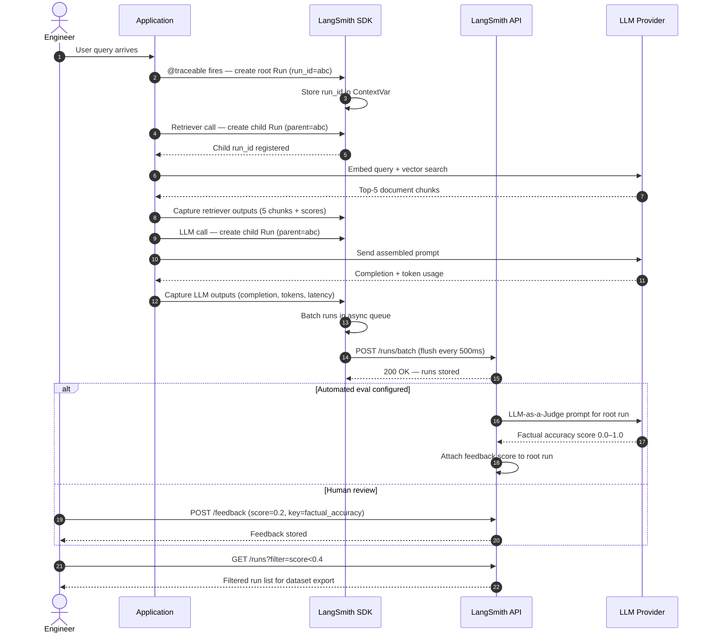

# W3D7 — Distributed Tracing (LangSmith)
**Vertical:** Production Evals & Guardrails | **Week 3/4 | Day 7/7**

---

## 1. Overview

Modern LLM applications are not single-function programs — they are pipelines of retrieval, reasoning, tool execution, and generation steps, often spanning multiple agents and models. When such a pipeline produces a wrong or harmful answer, identifying the responsible step through logs alone is impractical. **Distributed tracing** applies the observability pattern from microservices engineering to LLM pipelines: every step in a run is captured as a structured span, nested into a tree that mirrors the actual call hierarchy. LangSmith is the leading platform implementing this pattern for LLM workloads, adding LLM-specific capabilities such as token accounting, prompt/completion capture, eval score binding, and one-click dataset export. As agentic systems grow more complex — as seen in W3D6's Hierarchical Subagent Teams — distributed tracing transitions from a nice-to-have into a production prerequisite.

---

## 2. Learning Objectives

By the end of this document, you will be able to:

- [ ] Explain what a distributed trace is and how it differs from flat application logging
- [ ] Implement LangSmith tracing in a LangChain and a custom (non-LangChain) Python pipeline using the `@traceable` decorator and `RunTree` API
- [ ] Distinguish between a run, a span, a trace, and a feedback score in LangSmith's data model
- [ ] Design a feedback loop that attaches automated eval scores to individual spans for root-cause analysis
- [ ] Evaluate the latency and cost overhead of tracing and decide when sampling is appropriate
- [ ] Build an export pipeline that turns low-scored traces into a labelled fine-tuning dataset
- [ ] Apply OpenTelemetry instrumentation to route LangSmith traces to a secondary observability backend (e.g., Jaeger, Honeycomb)

---

## 3. Problem Statement

**What breaks:** An LLM agent pipeline returns an incorrect or hallucinated answer. The application logs record the final user-facing string and an HTTP 200. There is no record of which documents were retrieved, which prompt was assembled, which model variant was called, or whether a tool returned an error that was silently swallowed.

**How it breaks:** Multi-step pipelines have compounding failure modes. A retrieval step that returns a low-relevance document corrupts the context window for every downstream step. A reranker that silently scores everything equally lets noise through. A tool call that times out and returns an empty result causes the LLM to hallinate a substitute. Any of these failures propagates invisibly unless the intermediate states are captured.

**Production impact:** Without intermediate state capture, mean-time-to-resolve (MTTR) for LLM bugs can exceed hours. A team debugging a production incident without traces typically: (1) reproduces the input, (2) adds print statements, (3) redeploys, (4) waits for the failure to recur — a cycle that can take 2–6 hours per iteration. With a full trace already stored, the same diagnosis takes under 5 minutes.

**Why naive solutions fail:** Adding `print()` statements or flat application logs captures isolated values but loses the causal tree. You cannot tell from two separate log lines that the second was caused by the first, or that both were part of the same user request. Correlation IDs help but require manual propagation and still produce flat timelines. Distributed tracing provides the parent-child span structure, automatic correlation, and the timing envelope that flat logs cannot.

---

## 4. Real-World Scenarios

### Scenario A — The Problem

> **System:** A customer support bot for a SaaS platform, handling 8,000 conversations per day using a RAG pipeline with a 3-step retrieval chain, an LLM reranker, and a GPT-4o generation step.
> **Failure:** The bot occasionally gives billing advice that contradicts the actual pricing page. Frequency: approximately 60 incidents per week. Each requires manual escalation to a human agent.
> **Impact:** 60 escalations × 15 minutes average handle time = 15 engineer-hours per week wasted. CSAT score degraded by 12 points on affected conversations.

The engineering team has basic logging: request ID, user ID, timestamp, and the final response string. When a bad response is flagged, they can retrieve the final answer from logs but cannot see which documents the retriever returned, what the assembled context looked like before it was sent to GPT-4o, or whether the reranker promoted an outdated pricing document to the top position.

Reproducing the failure requires resending the exact query, which is unreliable because retrieval results are not deterministic (embedding model updates, index drift). The team has spent 3 weeks on this bug without identifying the root cause. They know the final answer is wrong; they do not know where in the 5-step pipeline the error originates.

### Scenario B — The Solution

> **System:** Same customer support bot, now instrumented with LangSmith tracing using the `@traceable` decorator on each pipeline function.
> **Applied Concept:** Distributed tracing with per-span input/output capture and automated eval score binding.
> **Improvement:** MTTR reduced from ~4 hours to ~8 minutes. Root cause identified within one day of deployment: the reranker was promoting a document last updated 14 months ago containing a deprecated pricing tier.

With tracing enabled, each conversation produces a run tree in LangSmith with the following spans: `retrieve_documents` (inputs: query embedding, outputs: 5 document chunks with scores), `rerank` (inputs: 5 chunks, outputs: reranked list), `assemble_context` (inputs: top-3 chunks, outputs: assembled prompt), `generate` (inputs: full prompt, outputs: completion, token counts). An LLM-as-a-Judge evaluator runs after each generation and attaches a `factual_accuracy` score to the `generate` span.

When a bad response is flagged, the engineer opens the LangSmith trace for that run ID, sees the `factual_accuracy` score of 0.2, clicks into the `rerank` span, and sees that the deprecated pricing document was ranked first with score 0.91. The fix — updating the document index — takes 20 minutes. The entire diagnosis took 8 minutes.

---

## 5. Solution Architecture

A LangSmith distributed tracing setup consists of four layers working together. The **instrumentation layer** decorates pipeline functions (or wraps LangChain components) to emit span start/end events with captured inputs and outputs. The **transport layer** batches these events and ships them asynchronously to the LangSmith API, ensuring tracing adds minimal latency to the hot path. The **storage layer** in LangSmith persists run trees, indexes them by project and run ID, and makes them queryable. The **analysis layer** provides the UI for browsing traces, the feedback API for attaching scores, and the dataset export API for creating training sets from filtered runs.

The key structural concept is the **run tree**: a hierarchical tree of `Run` objects where each node represents one pipeline step. The root node is the top-level agent or chain invocation. Child nodes are any nested calls — retrievers, tools, sub-agents, or LLM calls — that execute within the root's scope. Timing envelopes are captured automatically; the parent span's duration is the wall-clock time from its start to its last child's end.

### Architecture Diagram

See `diagrams/architecture.mmd` for the full diagram. Summary of layers:

- **Application Layer:** User request enters the application. The `@traceable` decorator or LangChain callback intercepts the call and creates a root `Run`.
- **Tracing Layer:** Each nested call creates a child `Run`. Inputs, outputs, errors, and token counts are captured at each node boundary.
- **LangSmith API:** Runs are batched and sent asynchronously via the LangSmith SDK. The API stores them as a tree indexed by `run_id` and `parent_run_id`.
- **Analysis Layer:** Engineers query traces, attach feedback scores, export datasets, and configure automated evaluators.

---

## 6. Internal Working Mechanics

### Step-by-Step Process

1. **Run creation** — When a `@traceable`-decorated function is called, the LangSmith SDK creates a `Run` object with a UUID, captures the function's input arguments as the span's `inputs` field, and records the start timestamp. If a parent run context is active (propagated via Python context variables), the new run is registered as a child of that parent.

2. **Child propagation** — The current run ID is stored in a `contextvars.ContextVar`. Any nested `@traceable` function call within the same execution context reads this variable and sets its own `parent_run_id` accordingly. This works correctly across `asyncio` tasks because Python's `contextvars` module copies context for each new task.

3. **Output capture** — When the decorated function returns, the SDK captures the return value as the span's `outputs` field and records the end timestamp. If the function raises an exception, the error message and traceback are captured in the `error` field and the span is marked as failed.

4. **Async batching** — Completed spans are placed in an in-memory queue. A background thread (or async task) drains the queue and POSTs batches to the LangSmith API every 500ms or when the batch reaches 100 runs. This decouples tracing from the request hot path.

5. **Feedback attachment** — After a run completes, any process (human reviewer, automated evaluator, LLM-as-a-Judge pipeline) can call the `client.create_feedback()` API with the `run_id`, a `key` (e.g., `"factual_accuracy"`), and a `score` (0.0–1.0). The feedback is stored alongside the run and surfaced in the trace view.

6. **Dataset export** — The `client.create_example()` API creates a dataset entry from a run's inputs and outputs. Filtered exports (e.g., all runs where `factual_accuracy < 0.4`) are available via `client.list_runs()` with filter expressions.

### Key Data Structures

```python
from dataclasses import dataclass, field
from typing import Optional, Any
from datetime import datetime
import uuid

@dataclass
class RunSpan:
    run_id: str = field(default_factory=lambda: str(uuid.uuid4()))
    parent_run_id: Optional[str] = None    # None for root spans
    name: str = ""                          # Decorated function name
    run_type: str = "chain"                 # "llm", "tool", "retriever", "chain"
    inputs: dict = field(default_factory=dict)
    outputs: Optional[dict] = None          # Populated on function return
    error: Optional[str] = None             # Populated if exception raised
    start_time: datetime = field(default_factory=datetime.utcnow)
    end_time: Optional[datetime] = None
    extra: dict = field(default_factory=dict)  # Token counts, model name, etc.

@dataclass
class FeedbackScore:
    run_id: str
    key: str           # e.g., "factual_accuracy", "helpfulness"
    score: float       # 0.0 to 1.0
    comment: Optional[str] = None
    source: str = "model"  # "model", "human", "rule"
```

---

## 7. Architecture Diagram

See `diagrams/architecture.mmd`.



---

## 8. Sequence Diagram

See `diagrams/sequence.mmd`.



---

## 9. Implementation Guide

### Prerequisites

```bash
pip install langsmith langchain-openai openai pytest
```

Set environment variables (or use a `.env` file loaded by `python-dotenv`):

```bash
export LANGCHAIN_TRACING_V2=true
export LANGCHAIN_API_KEY=your-langsmith-api-key
export LANGCHAIN_PROJECT=w3d7-distributed-tracing
export OPENAI_API_KEY=your-openai-api-key
```

### Step 1: Instrument a custom pipeline with `@traceable`

```python
# The @traceable decorator is the lowest-friction way to add tracing
# to any Python function — no LangChain required.
from langsmith import traceable
from langsmith.wrappers import wrap_openai
from openai import OpenAI

client = wrap_openai(OpenAI())  # Wraps OpenAI client to auto-trace LLM calls

@traceable(run_type="retriever", name="retrieve_documents")
def retrieve_documents(query: str) -> list[dict]:
    # Simulate vector store retrieval
    return [{"content": f"Doc about {query}", "score": 0.87}]

@traceable(run_type="chain", name="rag_pipeline")
def rag_pipeline(user_query: str) -> str:
    docs = retrieve_documents(user_query)  # Child span created automatically
    context = "\n".join(d["content"] for d in docs)
    response = client.chat.completions.create(
        model="gpt-4o-mini",
        messages=[
            {"role": "system", "content": f"Answer using: {context}"},
            {"role": "user", "content": user_query},
        ]
    )
    return response.choices[0].message.content
```

### Step 2: Attach feedback scores programmatically

```python
from langsmith import Client
import uuid

ls_client = Client()

# After a run completes, attach an automated eval score
def attach_eval_score(run_id: str, score: float, key: str = "factual_accuracy"):
    ls_client.create_feedback(
        run_id=run_id,
        key=key,
        score=score,
        comment=f"Automated eval — {key}"
    )
```

### Step 3: Export low-scoring runs as a dataset

```python
# Pull all runs in the project with factual_accuracy < 0.4
# These become your fine-tuning or few-shot correction dataset
runs = ls_client.list_runs(
    project_name="w3d7-distributed-tracing",
    filter='and(eq(feedback_key, "factual_accuracy"), lt(feedback_score, 0.4))'
)

dataset = ls_client.create_dataset("low-accuracy-corrections")
for run in runs:
    ls_client.create_example(
        inputs=run.inputs,
        outputs=run.outputs,
        dataset_id=dataset.id
    )
```

### Step 4: Run and verify

```bash
python src/main.py
# Expected output:
# Running RAG pipeline with tracing enabled...
# Run ID: 3f8a1c2d-...
# Answer: [generated answer]
# Trace URL: https://smith.langchain.com/o/.../projects/.../runs/3f8a1c2d-...
# ✅ Trace captured: 3 spans (rag_pipeline > retrieve_documents > llm_call)
```

---

## 10. Benefits & Trade-offs

| Benefit | Trade-off |
|---|---|
| Full causal tree for every request — root-cause analysis in minutes | Tracing adds ~2–5ms latency per request for SDK serialisation (async batching mitigates hot-path impact) |
| Token counts and cost captured per span — enables per-step cost attribution | LangSmith API costs apply for high-volume pipelines (pricing tiers based on run volume) |
| Eval scores bound to specific spans — not just the final answer | Storage of full prompt/completion text can create PII exposure risks requiring scrubbing before logging |
| One-click dataset export from filtered traces — closes the eval→training loop | Trace data volume scales with pipeline complexity — deep agent trees generate many spans per request |
| Vendor-agnostic with OpenTelemetry bridge — not locked to LangSmith backend | OTEL integration requires additional SDK configuration and a compatible collector |

---

## 11. Performance Characteristics

- **Latency overhead (P50):** 1–3ms added to request latency when using async batching. The SDK places completed runs in a non-blocking queue; the flush thread runs out-of-band.
- **Latency overhead (P95):** Up to 10ms in high-throughput scenarios where the queue depth grows. Tunable via `LANGCHAIN_CALLBACKS_BACKGROUND=true` (default in recent SDK versions).
- **Memory footprint:** The in-memory queue holds up to 100 run batches before flushing. Each run object is approximately 2–20 KB depending on prompt/completion size. Under normal load this is negligible; with very large context windows (100k+ tokens) run objects can be several hundred KB.
- **Throughput scaling:** The LangSmith SDK uses a single background thread for flushing. At very high throughput (>1,000 requests/second), multiple flush workers or sampling should be considered.
- **Bottleneck under load:** The LangSmith API ingestion endpoint. For high-volume production workloads, configure sampling (e.g., trace 10% of successful runs, 100% of failed runs) to reduce API pressure.

---

## 12. Security Considerations

- **LLM06 — Sensitive Information Disclosure (OWASP LLM Top 10):** LangSmith captures full prompt and completion text by default. Prompts may contain PII, credentials, or proprietary business data. Implement a scrubbing function that redacts sensitive fields before the span is sent. Use the `hide_inputs` and `hide_outputs` parameters on `@traceable` for functions handling PII.
- **LLM02 — Insecure Output Handling:** Trace data stored in LangSmith is accessible to all members of the LangSmith project. Apply project-level access controls. Do not store traces from a production system in a shared development project.
- **API key management:** `LANGCHAIN_API_KEY` must be treated as a secret. Rotate it if exposed. Use separate API keys for development, staging, and production projects.
- **Input validation:** User inputs captured in trace spans are stored verbatim. Prompt injection attempts will appear in the trace. This is useful for security auditing but requires that trace data be treated with the same access controls as raw user input.
- **Data residency:** LangSmith is hosted in the US by default. For EU/GDPR compliance, evaluate whether self-hosted LangSmith or an OTEL-compatible self-hosted alternative (e.g., Jaeger + custom LLM span processor) is required.

---

## 13. Cost Analysis

| Workload | Spans per Request | Monthly Span Volume | Approx. LangSmith Cost |
|---|---|---|---|
| Prototype / dev | 5 spans | ~50k spans/month | Free tier (LangSmith Developer: 5k runs/month free, then ~$0.005/run) |
| Small production (1k req/day) | 5 spans | ~150k runs/month | ~$750/month at list price (volume discounts available) |
| Mid-scale (10k req/day) | 8 spans | ~2.4M runs/month | Enterprise pricing — negotiate per-run rate |
| High-volume with 10% sampling | 8 spans | ~240k runs/month | ~$1,200/month |

**Cost vs. accuracy trade-off:** Full tracing at 100% sampling maximises debugging capability but scales linearly with request volume. For cost-sensitive deployments, trace 100% of error cases (non-2xx, low eval score) and sample 5–10% of successful cases. This preserves full observability for failures while reducing cost by ~90%.

**Token cost for automated evals:** An LLM-as-a-Judge evaluator running GPT-4o-mini on every trace adds approximately 300–500 tokens per evaluation. At $0.15/1M input tokens, this is ~$0.0001 per evaluation — negligible at most scales.

---

## 14. Best Practices

1. **Trace from the entry point down.** Decorate the top-level function (the one that receives the user request) as the root span. All nested `@traceable` calls will automatically become children. Do not start tracing midway through a pipeline — you lose the causal context.

2. **Name spans after the business operation, not the implementation.** Use `name="retrieve_support_articles"` rather than `name="chroma_similarity_search"`. When you swap vector stores, the trace names remain stable and your dashboards do not break.

3. **Capture metadata on LLM spans.** Always include model name, temperature, and token counts in span metadata. LangSmith captures these automatically for wrapped OpenAI clients; for other providers, add them to `extra`.

4. **Implement PII scrubbing before spans are sent.** Write a middleware that strips email addresses, phone numbers, and credit card patterns from span inputs/outputs. Apply it as a custom callback rather than post-processing stored traces.

5. **Bind eval scores within 60 seconds of run completion.** Automated evaluators should attach scores as close to run completion as possible. Stale feedback (attached hours later) reduces the correlation between the trace context and the score.

6. **Use sampling in production, full tracing in staging.** Run 100% tracing in staging to catch regressions. In production, trace all failures (score < threshold, exception raised) and sample 10% of successes. This gives full coverage for debugging without runaway costs.

7. **Export bad traces to a dataset weekly.** Set up a cron job that exports runs with `factual_accuracy < 0.4` from the past week into a LangSmith dataset. Review these manually before using them as fine-tuning data — automated evals are not perfect.

8. **Tag spans with deployment version.** Add `deployment_version` to span metadata. When a model update causes a regression, you can filter traces by version and compare score distributions before and after.

9. **Alert on span error rate, not just final response errors.** Set up a webhook or monitoring query that fires when more than 5% of retriever spans return empty results. A retriever degradation will appear at the span level before it manifests as a visible accuracy drop in final responses.

10. **Use `RunTree` for non-decorator workflows.** When you cannot use `@traceable` (e.g., in a framework that manages its own async loop), use the `RunTree` API directly to create, patch, and post runs with explicit parent-child relationships.

---

## 15. Anti-Patterns

### The Flat Logger
- **What it looks like:** Replacing `@traceable` with `logger.info(f"Retriever returned: {docs}")` — flat log lines with no parent-child relationship.
- **Why it fails:** Flat logs cannot reconstruct which retriever call belonged to which user request without manual correlation ID threading. Under concurrent load, log lines interleave and correlation becomes unreliable.
- **Instead:** Use `@traceable` which automatically propagates run IDs via Python's `contextvars` — no manual correlation required.

### The God Span
- **What it looks like:** Decorating only the top-level function and letting everything run inside it with no child spans.
- **Why it fails:** The trace shows a single span with the final input and final output. You cannot see which intermediate step failed. The trace is no more useful than a flat log.
- **Instead:** Decorate each logical step as a separate span. A 5-step pipeline should produce a 5-node tree.

### Trace Everything Including Secrets
- **What it looks like:** Passing user authentication tokens, API keys, or credit card numbers through traceable functions without scrubbing.
- **Why it fails:** All captured inputs are stored in LangSmith and visible to everyone with project access. This is a data breach vector if the project is shared or the LangSmith account is compromised.
- **Instead:** Use `@traceable(hide_inputs=True)` for functions that handle sensitive data, or implement a scrubbing callback that redacts known PII patterns before the span is shipped.

### Synchronous Flush in the Hot Path
- **What it looks like:** Calling `ls_client.flush()` synchronously at the end of every request handler.
- **Why it fails:** A synchronous flush blocks the response until LangSmith's API responds. Under load or API latency spikes, this adds 50–500ms to every user-facing request.
- **Instead:** Use async batching (the default). Only call `flush()` in shutdown hooks or in test teardown.

### Tracing Without Evaluating
- **What it looks like:** Collecting thousands of traces but never attaching feedback scores or reviewing them.
- **Why it fails:** Traces without scores are just data. You cannot filter for bad runs, cannot build a training dataset, and cannot track quality over time. The observability stack becomes expensive storage with no ROI.
- **Instead:** Deploy at least one automated evaluator (LLM-as-a-Judge or a deterministic rule) on day one. Even a simple length or format check provides a filterable signal.

---

## 16. Common Mistakes

| Symptom | Root Cause | Fix |
|---|---|---|
| Traces appear in LangSmith but span tree is flat — all spans show as root runs | `LANGCHAIN_TRACING_V2` is set but the functions are not decorated with `@traceable`, or they are called from a different `asyncio` task that did not inherit the context | Ensure all pipeline functions use `@traceable` and that `asyncio` tasks are created with `asyncio.create_task()` (which copies `contextvars`) rather than `loop.run_in_executor()` |
| No traces appear in LangSmith despite `LANGCHAIN_TRACING_V2=true` | `LANGCHAIN_API_KEY` is missing or invalid, or the SDK version is below 0.1.0 | Verify the key with `langsmith.Client().list_projects()` and run `pip install --upgrade langsmith` |
| Traces appear but inputs/outputs show as `null` | The decorated function's arguments or return value are not JSON-serialisable (e.g., Pydantic models, numpy arrays) | Implement a custom serialiser or convert to dict/list before returning; LangSmith SDK does not call `model_dump()` automatically |

---

## 17. Production Checklist

- [ ] `@traceable` applied to all pipeline entry points and major intermediate steps
- [ ] `LANGCHAIN_API_KEY` stored in a secrets manager, not in source code or `.env` committed to git
- [ ] PII scrubbing callback implemented and tested with a synthetic PII input
- [ ] Separate LangSmith projects configured for development, staging, and production
- [ ] Automated evaluator deployed (at minimum: LLM-as-a-Judge on factual accuracy)
- [ ] Feedback scores attached within 60 seconds of run completion
- [ ] Sampling configured for production: 100% error runs, 10% success runs
- [ ] Alert configured: fires when retriever span error rate exceeds 5% in a 5-minute window
- [ ] Dataset export cron job scheduled: weekly export of runs with score < 0.4
- [ ] Deployment version tag added to all root span metadata
- [ ] Async flushing confirmed: `LANGCHAIN_CALLBACKS_BACKGROUND=true` (or SDK default)
- [ ] Trace data retention policy documented and configured in LangSmith project settings
- [ ] Access controls reviewed: production project access restricted to on-call engineers

---

## 18. References

```
[1] LangChain Inc. (2024). "LangSmith Documentation — Tracing". LangSmith Docs.
    https://docs.smith.langchain.com/tracing

[2] LangChain Inc. (2024). "LangSmith Python SDK — @traceable decorator".
    https://docs.smith.langchain.com/how_to_guides/tracing/annotate_code

[3] OpenTelemetry Authors (2024). "OpenTelemetry Python SDK".
    https://opentelemetry.io/docs/instrumentation/python/

[4] OWASP (2023). "OWASP Top 10 for Large Language Model Applications".
    https://owasp.org/www-project-top-10-for-large-language-model-applications/

[5] Brundage, M. et al. (2020). "Toward Trustworthy AI Development: Mechanisms
    for Supporting Verifiable Claims". arXiv:2004.07213

[6] LangChain Inc. (2024). "LangSmith Cookbook — Evaluation and Feedback".
    https://github.com/langchain-ai/langsmith-cookbook
```

---

## 19. Summary

Production LLM pipelines fail in ways that are invisible to conventional application monitoring. Distributed tracing — as implemented by LangSmith — captures the full causal tree of every request: every retrieval step, every rerank, every LLM call, and every tool invocation, with inputs, outputs, timings, and token counts at each node. This transforms debugging from hours of guesswork into minutes of tree navigation. The pattern's deeper value emerges when eval scores are bound to individual spans: you can locate not just that an answer was wrong, but precisely which pipeline step introduced the error. Combined with the dataset export capability, tracing closes the full loop from production failure to training data to model improvement — the flywheel that separates teams that improve from teams that only react.

---

## 20. Exercises

**Beginner:** Run the PoC with `DEMO_MODE=true`. Inspect `sample_output.json` and identify which field corresponds to the root span's run ID and which fields represent child spans.

**Intermediate:** Modify `tracing_core.py` to add a fourth pipeline step — a `validate_answer` function that checks whether the generated answer contains at least one numeric value. Observe how this new span appears in the trace tree when running in live mode.

**Advanced:** Extend the PoC to attach an LLM-as-a-Judge eval score to every completed root run. The judge prompt should assess factual consistency between the retrieved documents and the generated answer. Write a script that exports all runs with a judge score below 0.5 to a new LangSmith dataset.

**Expert:** Benchmark the latency overhead of tracing vs. no-tracing across 100 requests at three pipeline depths (1 span, 5 spans, 15 spans). Report P50 and P95 latency for each configuration. Compare async batching vs. synchronous flushing. Document at which depth and concurrency level sampling becomes cost-justified.

**Research:** Read LangChain's LangSmith documentation on "Online Evaluation" (https://docs.smith.langchain.com/evaluation/concepts#online-evaluation). Identify one limitation of the current automated evaluator architecture — specifically regarding evaluator latency and its effect on the feedback signal freshness — and propose a mitigation strategy.

---

## 21. Interview Questions

**Conceptual**

1. Explain distributed tracing to a non-engineer using an analogy from everyday life. What is the equivalent of a "span" and a "trace" in your analogy?

2. What is the difference between distributed tracing and structured logging? When is each the right tool?

**Technical**

3. How does the LangSmith SDK propagate parent run IDs across nested function calls without requiring the developer to pass them explicitly? What Python mechanism is used?

4. A `@traceable`-decorated async function spawns 3 concurrent child tasks using `asyncio.gather()`. Will all 3 child tasks correctly inherit the parent run ID? Explain why or why not.

**Design**

5. You are designing a tracing system for a multi-agent pipeline that processes 50,000 requests per day with an average of 12 spans per request. Design a sampling strategy that keeps debugging capability high while staying within a $500/month observability budget.

6. Your organisation has a strict GDPR requirement: no user PII may leave the EU. You want to use LangSmith for tracing. What architecture options do you have, and what are the trade-offs of each?

**Debugging**

7. A pipeline that was working correctly yesterday now shows 40% of root spans completing with a `null` output in LangSmith, while the application logs show successful responses being returned to users. What is your diagnostic process?

8. LangSmith trace volume suddenly increases 10× without a corresponding increase in user traffic. What are the three most likely causes, and how would you verify each?

**Trade-offs**

9. When would you choose full 100% sampling over statistical sampling for a production LLM pipeline? What production signals would cause you to switch back to sampling?

10. LangSmith captures full prompt and completion text. A colleague argues this is a security liability and proposes logging only metadata (tokens, latency, model). What capability do you lose, and how would you architect a compromise that satisfies both security and observability requirements?
